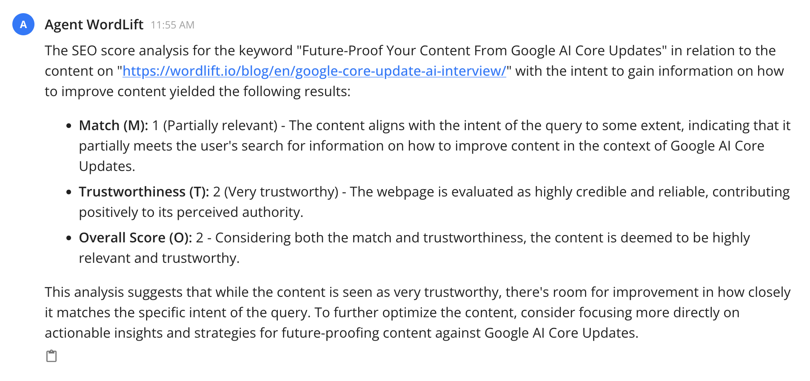
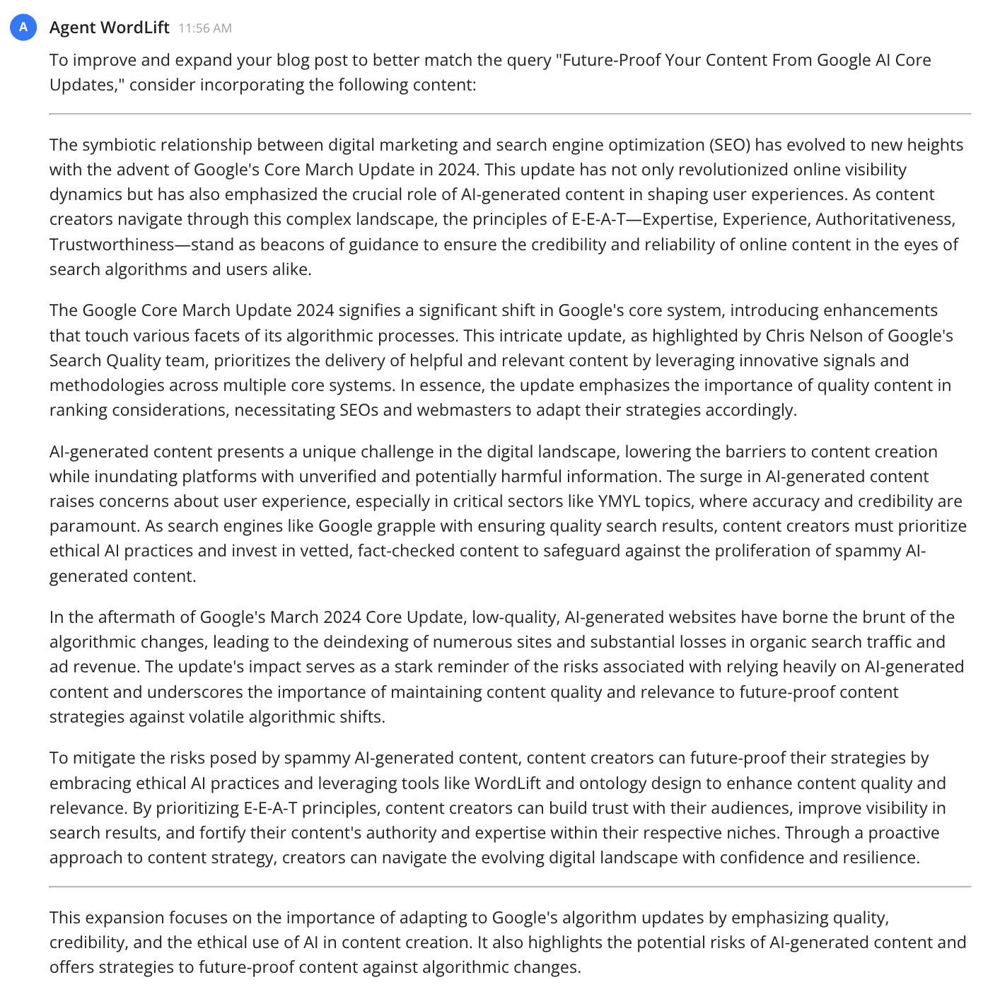

# Search Intent Match

This workflow is designed to help us **align our content with the intended search query** to ensure maximum relevance and engagement from our target audience. By understanding and (matching the search intent)[https://wordlift.io/blog/en/search-intent-optimization/], we can create content that not only ranks well but also satisfies the user's informational needs.


## Here are the steps:

To ensure your webpage aligns perfectly with the intended search query, follow this streamlined workflow:

1. Identify the Core Query and Intent: Start by pinpointing the exact query you aim to target. Understand the intent behind the search - is it informational, navigational, transactional, or investigational? You can try a prompt like the one below:

```md
analyze the SEO score for the keyword 'Future-Proof Your Content From Google Core Updates' in relation to the content on 'https://wordlift.io/blog/en/google-core-update-ai-interview/' the intent is to gain information on how to improve existing content.
```

With this prompt, we define the **query**, the **url** as well as the narrative behind the searcher's intent.

### Here is what we get:



2. Expand the content based on the analysis

Within the first response, we can now proceed with the following step to gain new insights on how to improve the article in order to match the provided query and search intent:

```md
Can you help me improve and expand the blog post to match the query?
```

### Here are the suggestions:



### Can we do it all in one step?

Of course you can. Here is the prompt:

```md
analyze the SEO score for the keyword 'Future-Proof Your Content From Google AI Core Updates' in relation to the content on 'https://wordlift.io/blog/en/google-core-update-ai-interview/' the intent is to gain information on how to improve content. After that help me improve and expand the blog post accordingly.
```

### Here is the result:


:::info

The [SEO Score API](https://docs.wordlift.io/api/seo-score/create-seo-score/) behind this workflow is still experimental and represents an advanced solution meticulously designed to evaluate page relevance with the precision of a quality rater. This advanced tool demands editors to exert considerable effort to achieve the highest match scores, mirroring the rigorous standards of search engine optimization. Read the full details from WordLift's blog on [search intent optimization](https://wordlift.io/blog/en/search-intent-optimization/).

:::