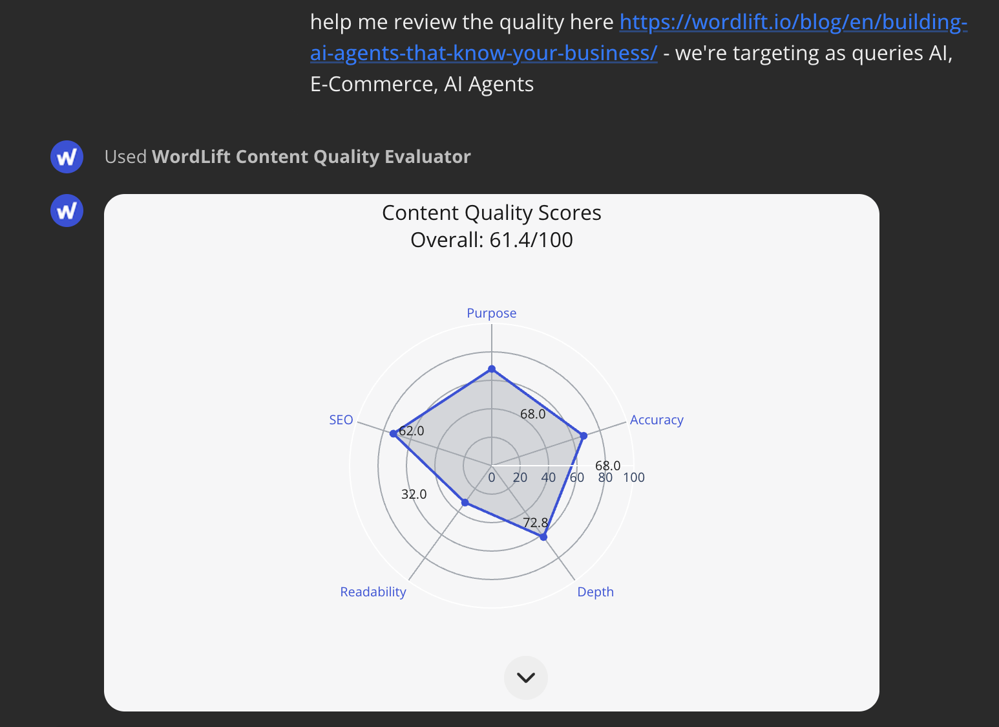

# Evaluating Content Quality with WordLift AI SEO Agent

The Content Quality Evaluation workflow allows you to comprehensively assess your content across multiple dimensions including quality, readability, and SEO performance. This powerful tool provides actionable insights to improve your content and make it more engaging for both users and search engines.

## Overview of Content Evaluation

WordLift's Content Evaluation Tool goes beyond traditional SEO analysis by examining multiple dimensions of your content:

- **Content Quality**: Analyzes purpose, accuracy, and depth of your content
- **Readability**: Evaluates reading level, sentence complexity, and overall clarity
- **SEO Performance**: Assesses keyword usage, density, and optimization
- **Metadata**: Examines word count, sentiment, and other technical aspects

The tool visualizes these metrics through an intuitive radar chart, making it easy to identify strengths and areas for improvement.

## How to Use the Content Quality Evaluator

### Step 1: Analyze Your Content

Start by analyzing your content against a specific keyword or topic to understand how well it addresses the intended search intent. You can evaluate content in two ways:

**Option 1: Evaluate content at a URL:**

```md className=wlx-send-to-agent
evaluate the content quality for the keyword "content marketing strategies" in relation to the content on "https://your-website.com/your-page"
```

**Option 2: Evaluate text directly:**

```md className=wlx-send-to-agent
evaluate the following text for the keyword "content marketing strategies":

[Paste your content here]
```

You can include multiple keywords for a more comprehensive evaluation:

```md className=wlx-send-to-agent
evaluate the content quality for the keywords "content marketing strategies, SEO optimization, content distribution" in relation to the content on "https://your-website.com/your-page"
```

The tool works effectively with or without specified keywords. If no keywords are provided, it will identify the main topics of your content automatically.

### Evaluating Specific Content Sections

You can evaluate either entire articles or specific sections of your content:

```md className=wlx-send-to-agent
evaluate only the introduction section of the content on "https://your-website.com/your-page" for the keyword "content marketing"
```

This allows you to focus on improving specific parts of your content that may need more attention.

### Analyzing Multiple Content Pieces

When evaluating multiple pieces of content, you can request the agent to omit the chart visualization for a more streamlined analysis:

```md className=wlx-send-to-agent
evaluate the following URLs without rendering charts:
1. https://your-website.com/page-1
2. https://your-website.com/page-2
3. https://your-website.com/page-3

Compare their content quality and provide a summary table of the results.
```

This is particularly useful for batch analysis and content comparison tasks where visual charts for each piece might be overwhelming.

### Step 2: Review the Evaluation Results

The agent will return detailed analysis results including:

- An overall quality score (0-100)
- Breakdown of scores across multiple dimensions
- Specific insights about content strengths and weaknesses
- Visualization of the results in a radar chart



### Step 3: Implement Content Improvements

Based on the evaluation, you can then request specific improvements:

```md className=wlx-send-to-agent
based on the content quality evaluation, please suggest improvements to enhance the content purpose, depth, and readability
```

The agent will provide tailored recommendations to address the specific areas where your content needs improvement.

## Understanding the Evaluation Metrics

### Content Quality Metrics

- **Purpose**: How well the content fulfills its intended goal and satisfies user intent
- **Accuracy**: Factual correctness and trustworthiness of the information
- **Depth**: Comprehensiveness and thoroughness of topic coverage

### Readability Metrics

- **Score**: Overall readability level of the content
- **Grade Level**: Educational level required to easily understand the content
- **Complex Sentences**: Analysis of sentence complexity and suggestions for improvement

### SEO Metrics

- **Score**: Overall search optimization assessment
- **Keyword Density**: Analysis of keyword usage and distribution
- **Top Entities**: Important concepts and topics identified in the content

## Best Practices for Content Evaluation

1. **Evaluate Regularly**: Periodically assess your most important pages to ensure they remain optimized
2. **Compare with Competitors**: Evaluate your content against top-ranking competitors for the same keywords
3. **Focus on Weakest Areas First**: Prioritize improvements for dimensions with the lowest scores
4. **Balance All Dimensions**: Aim for consistent performance across all metrics rather than excellence in just one area
5. **Test Improvements**: After making changes, re-evaluate to confirm the enhancements were effective

By following this workflow, you can systematically improve your content across multiple dimensions, resulting in better engagement, higher authority, and improved search visibility.

:::tip
For content that targets multiple keywords or topics, consider running separate evaluations for each major keyword to ensure comprehensive optimization.
:::

## Frequently Asked Questions

### How was this tool developed?

We've worked closely with professional content teams to align the Content Quality Evaluator with existing editorial practices. This collaboration helped us:

- Assess the quality standards of successful content
- Understand what experienced editors consider valuable
- Measure the SEO value of different content approaches
- Compare professionally-edited content with AI-generated content created with tools like ChatGPT

This real-world validation ensures the tool provides evaluations that align with both editorial excellence and SEO performance requirements, bridging the gap between content quality and search optimization.

### How does the tool measure content accuracy?

The Content Quality Evaluator assesses accuracy through a sophisticated dual approach:
- **Factual Verification**: Analyzes internal coherence of claims and statements within the content
- **Logical Consistency Assessment**: Uses LLM-guided evaluation to check for logical consistency throughout the text
- **Cross-Reference Capability**: For specific domains, can reference known facts against reliable sources

The accuracy score represents how well the content presents factually correct and logically consistent information that readers can trust.

### How is content depth measured?

Content depth is evaluated through multiple signals that collectively determine how thoroughly a topic is covered:

- **Topic Coverage Breadth**: How comprehensively the content addresses various aspects of the main topic
- **Supporting Detail Density**: The richness of examples, statistics, and evidence provided
- **Analysis Complexity**: Whether the content goes beyond surface-level explanations to provide deeper insights
- **Citation Quality/Diversity**: The strength and variety of supporting references and sources
- **Semantic Richness Metrics**: The sophistication of vocabulary and concept relationships within the text

Higher depth scores indicate content that provides comprehensive, nuanced coverage rather than superficial treatment of topics.

### Can I use this tool for different content types?

Yes, the Content Quality Evaluator works effectively across various content types including:
- Blog posts and articles
- Product descriptions
- Landing pages
- Educational content
- Technical documentation

The evaluation adapts to the specific purpose and audience of your content type, providing relevant insights for each format.

### How often should I re-evaluate my content?

For high-value pages, we recommend re-evaluation:
- After significant content updates
- Quarterly for cornerstone content
- When search rankings fluctuate
- When industry information changes
- As part of regular content audits

Ongoing evaluation helps ensure your content remains relevant, accurate, and optimized for current search intent.