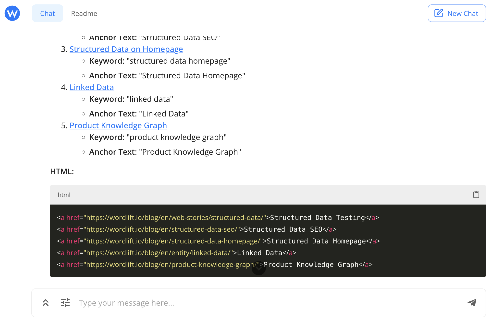

# Enhancing Internal Linking with WordLift AI SEO Agent

[Internal linking](https://wordlift.io/blog/en/dynamic-internal-links-in-seo/) is a critical aspect of SEO, helping to establish site architecture and spread link equity. With WordLift [AI SEO Agent](https://wordlift.io/ai-seo-agent/), you can streamline the process of creating internal links to enhance your website's SEO and user experience. This guide will walk you through the steps to effectively use Agent WordLift for creating internal links on your website.

## Overview of Internal Linking

Internal links are hyperlinks that point to other pages on the same website. They are crucial for helping search engines understand the structure and content hierarchy of your site, as well as for guiding visitors to related content. Effective internal linking can improve your site's SEO by ensuring that link equity is passed to the most important pages.

## Steps to Create Internal Links with Agent WordLift

### Step 1: Identify Content for Internal Linking

First, identify the pages on your website that you want to enrich by adding internal links. These could be cornerstone content, high-traffic pages, or pages you want to improve with links pointing to other relevant pages.

### Example Prompt for Identifying Related Articles

In the example below we use as a reference the WordLift blog.

```md className=wlx-send-to-agent
Find content on my website from the “What is structured data?” page (https://wordlift.io/blog/en/entity/structured-data/). Analyze the text to identify up to 5 related articles. For each article, determine a relevant keyword, generate keyword suggestions for each keyword, and create an anchor text of no more than 30 characters. Finally, compile the HTML for all 5 links with their respective anchor texts.
```



### Step 2: Batch Processing for Multiple Pages

If you need to create internal links for multiple pages, you can use a more comprehensive prompt to handle this in batches.

### Example Prompt for Batch Processing

```md className=wlx-send-to-agent
Find content on my website from the “What is structured data?” page (https://wordlift.io/blog/en/entity/structured-data/). Analyze the text to identify up to 5 related articles. For each article, determine a relevant keyword, generate keyword suggestions for each keyword, and create an anchor text of no more than 30 characters. Finally, compile the HTML for all 5 links with their respective anchor texts. Do the same work also for the pages: "The GS1 Digital Link explained for SEO Jedis (and their clients)" (https://wordlift.io/blog/en/gs1-digital-link-seo/), "Dynamic Internal Links in SEO: Your Superhero in the Generative AI Era" (https://wordlift.io/blog/en/dynamic-internal-links-in-seo/), "Understanding LLM Optimization: Ethical AI and Protecting Your Content" (https://wordlift.io/blog/en/understanding-llm-optimization/) and "From Harold Cohen to Modern AI: The Power of Symbolic Reasoning" (https://wordlift.io/blog/en/the-power-of-symbolic-reasoning/). Remember the following rules: never link to the homepage of the blog (https://wordlift.io/blog/en/) choose carefully the anchor based on the content relevancy and keyword opportunity analysis.
```

### Step 3: Execute the Prompt with WordLift AI SEO Agent

Using the prompts provided, execute the commands with WordLift AI SEO Agent. The tool will analyze the specified pages, identify related articles, and generate appropriate internal links along with suggested anchor texts.

### Step 4: Review and Implement the Suggestions

Once the internal links and anchor texts are generated, review them to ensure they align with your content strategy and SEO goals. Make any necessary adjustments before implementing them on your website.

## Best Practices for Internal Linking

1. **Use Descriptive Anchor Texts:** Ensure that the anchor texts are descriptive and relevant to the linked content.
2. **Link to Relevant Content:** Only link to pages that are contextually relevant to the content on the source page.
3. **Avoid Over-Linking:** Do not overcrowd your content with too many internal links, as this can dilute their value and affect readability.
4. **Regularly Update Links:** Periodically review and update your internal links to ensure they are still relevant and effective.

:::info

By following these steps and utilizing WordLift AI SEO Agent, you can create a robust internal linking structure that enhances your website's SEO performance and provides a better user experience. If you want to scale the internal linking on your website to multiple pages read the full details from WordLift's blog on [dynamic internal links](https://wordlift.io/blog/en/dynamic-internal-links-in-seo/) and [get in contact with our SEO management service](https://wordlift.io/seo-management-service/).

:::
