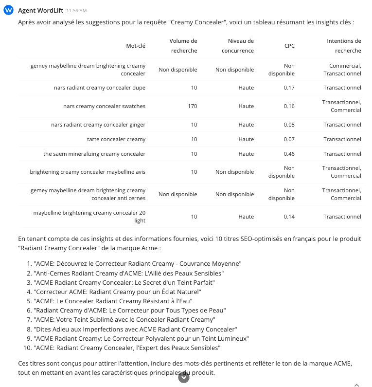

## Introduction

In this workflow, we'll demonstrate how to leverage **WordLift's AI SEO Agent** to craft compelling **e-commerce product descriptions** that stand out. The focus is to use *keyword insights* to enhance product visibility and appeal, especially for e-commerce platforms. Our example will center around creating enticing descriptions for a product using a strategic approach that involves analyzing keywords and integrating them seamlessly into the product descriptions.

## Crafting Product Descriptions

Our journey begins with an example that illustrates how to create an engaging description for an e-commerce product, using "Creamy Concealer" by Acme as our focal point.

### Here's the prompt:

```md
Analyze the "Creamy Concealer" by ACME, using its description and product category to extract key insights. Suggest relevant keywords that could enhance its online visibility. Based on these insights, generate 10 SEO-optimized product descriptions in French, each incorporating:
- Brand and product name
- Relevant keywords
- A tone that matches the brand's identity
- Characteristics that highlight the product's unique selling points## Crafting Product Descriptions




## How Things Work Behind the Scenes

The WordLift AI SEO Agent assists in this process by:

- **Analyzing Product Information**: It starts by examining the provided product details, including its description and category. This helps in understanding the product's key features and target audience.
- **Identifying Key Keywords**: The agent then identifies relevant keywords associated with the product. These keywords are essential for ensuring the product ranks well in search engine results. Agent will analyze keyword data.
- **Creating Engaging Descriptions**: Leveraging the product insights and identified keywords, WordLift crafts SEO-optimized product descriptions. These descriptions are designed to capture the attention of potential buyers and improve the product's search visibility.

Understanding this workflow allows you to trust the process, ensuring the descriptions are not only aligned with the brand's voice but are also optimized to attract and engage your target audience.