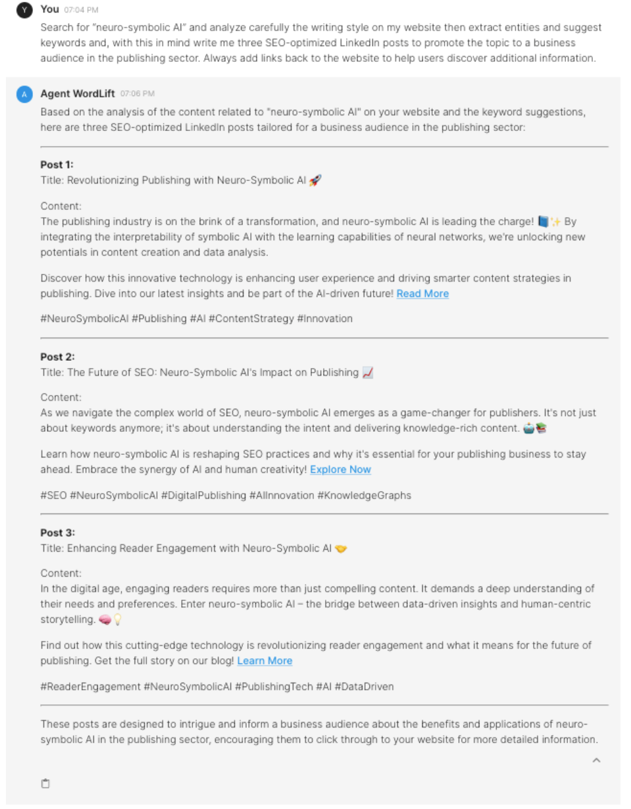
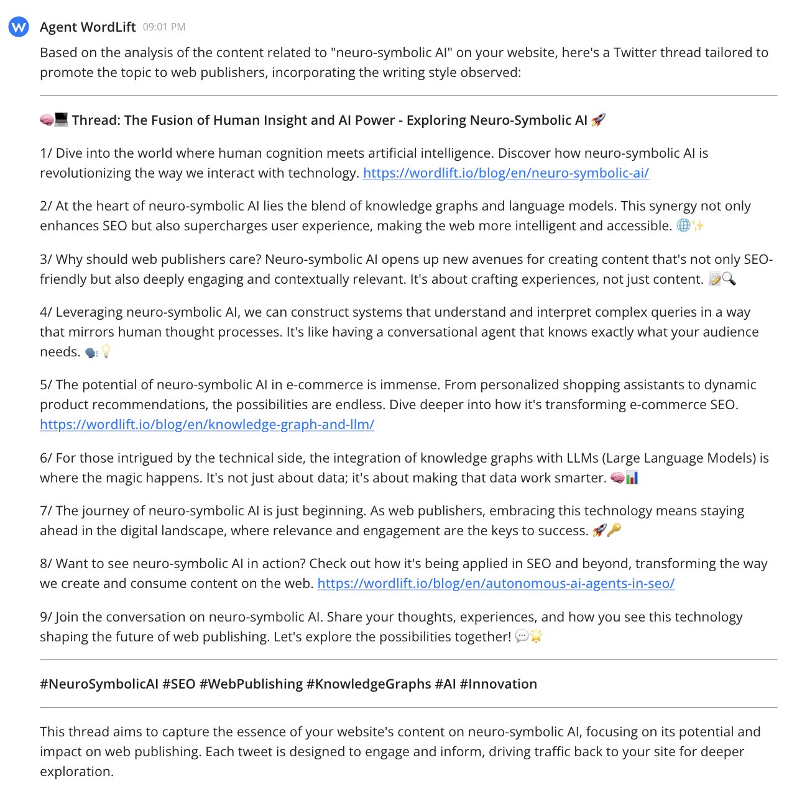
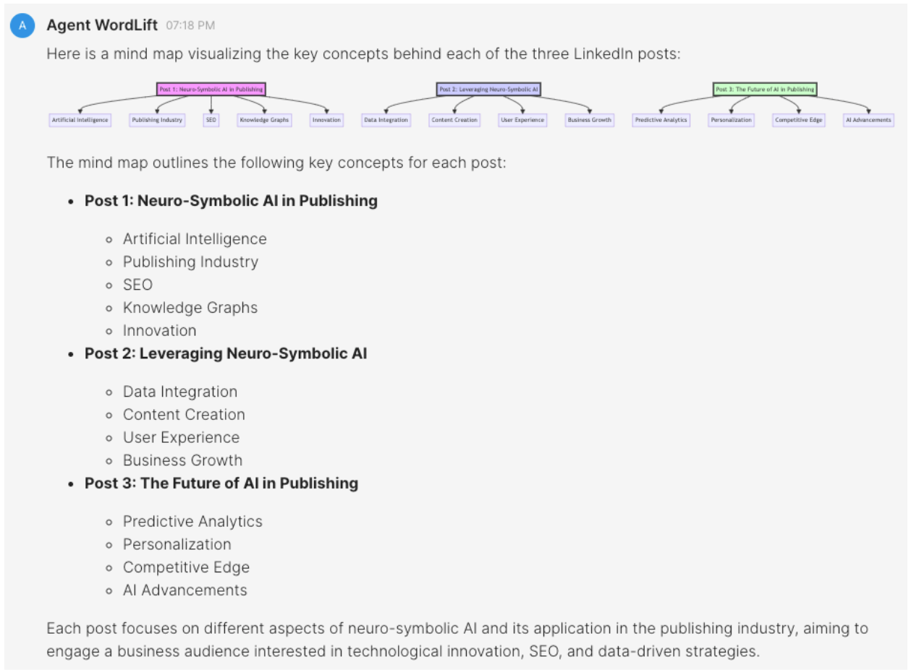

## Introduction

Today, our goal is to **create, with the help of WordLift, compelling posts for LinkedIn** using the content we have on our website. In this example, we will use the agent’s multifunctional capability to **perform several tasks based on a single prompt**. WordLift AI SEO Agent will analyze content, extract entities, suggest keywords, and generate SEO-optimized posts for a specific audience on LinkedIn.

## Writing Posts for LinkedIn

We will start with a first example related to our website to write content around “neuro-symbolic AI.”

### Here goes the prompt:

```md
Search for 'neuro-symbolic AI' and carefully analyze the writing style on my website, then extract entities and suggest keywords, and, with this in mind, write three SEO-optimized LinkedIn posts to promote the topic to a business audience in the publishing sector. Always add links back to the website to help users discover additional information.
```


## Creating a Thread on X

Let's do a similar excercise now for creating Twittr thread.

### Here goes the prompt for X:

```md
Search for 'neuro-symbolic AI' and carefully analyze the writing style on my website and, with this in mind, create a Twitter thread to promote the topic to web publishers. Always add links back to the website to help users discover additional information.
```



## How Things Work Behind the Scenes

Using the prompt above, WordLift effectively assists you by:

- **Analyzing Your Website:** It searches your website for content related to "neuro-symbolic AI" to gather relevant information and understand your writing style. This ensures the generated content aligns with your existing content and voice.
- **Identifying Key Terms:** It analyzes keywords related to "neuro-symbolic AI" and suggests relevant search terms to enhance your LinkedIn posts (or to create a thread on X). This expands your reach by including trending and related terms.
- **Crafting Engaging Content:** It leverages the insights from the website analysis and keyword suggestions to create social media posts highlighting the innovative aspects of neuro-symbolic AI, its relevance to the publishing sector, and its benefits. These posts are designed to engage a business audience on LinkedIn or X and include links to your website content.

Understanding these steps helps you trust the process and ensures the generated content aligns with your website's content and target audience.

## Final Review

Finally, we can review the key concepts behind the generated posts for LinkedIn with a new prompt:

```md
Draw a mind map of the key concepts behind each post.
```


This will produce the following result.

By following this workflow, you can efficiently produce targeted, **SEO-optimized social media content** that resonates with your audience, leveraging the comprehensive capabilities of the WordLift AI SEO Agent.
