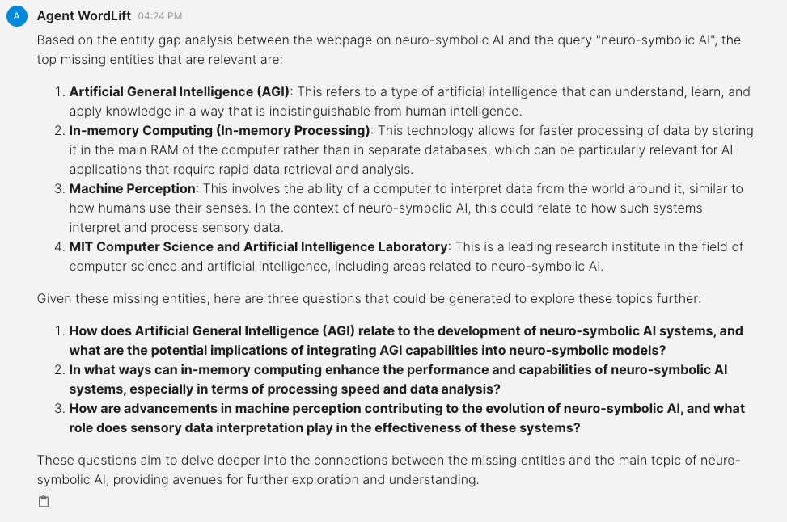
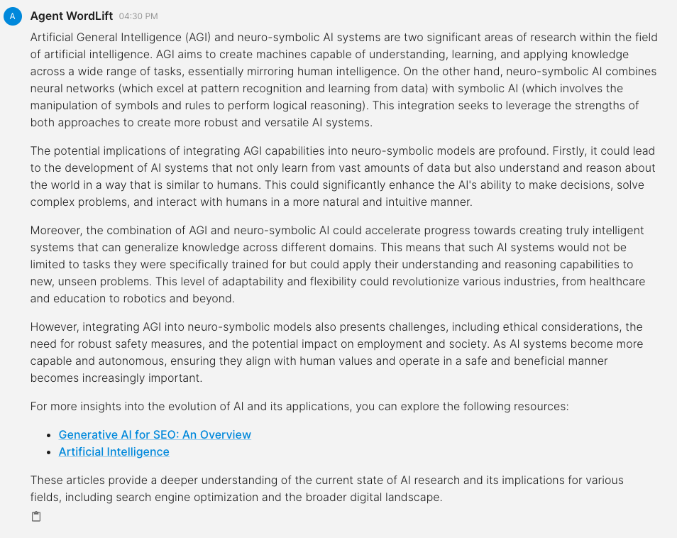

# FAQ

This workflow is designed to help us **answer frequently asked questions** based on the entity gap analysis performed with WordLift's AI SEO Agent. 

## Generate Questions Based on the Entity Gap Analysis

```md
Analyze the entity gap between https://wordlift.io/blog/en/neuro-symbolic-ai/ and the query "neuro-symbolic AI", look at the top missing entities and, if they are relevant, generate three questions accordingly.
```



## Answer the Questions

```md
Now, search on the website, read the writing style and prepare the answer for the first question "How does Artificial General Intelligence (AGI) relate to the development of neuro-symbolic AI systems, and what are the potential implications of integrating AGI capabilities into neuro-symbolic models?". Remember to add links back to the sources.
```


