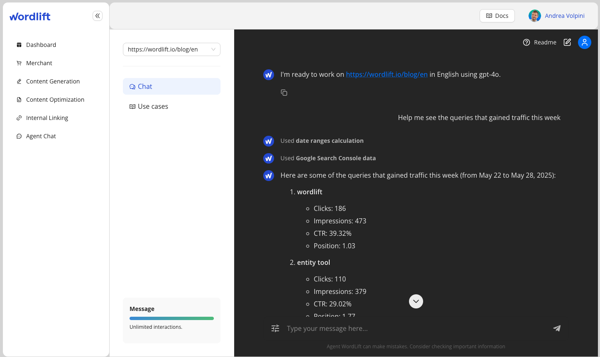

# Google Search Console Integration

The Google Search Console (GSC) integration enables WordLift Agent to connect directly with Google Search Console API 📈, providing access to search analytics data.

## Key Features

- **Direct GSC API Access:** Connect directly to Google's Search Console API to retrieve performance data (this is done using WordLift Dashboard)
- **OAuth Authentication:** Secure authentication flow with automated browser handling and token persistence
- **Date-Aware Analysis:** Built-in date utilities for working with the most current data
- **Multiple Dimensions:** Analyze data by query, page, device, country and other dimensions
- **Metrics Visualization:** Get clicks, impressions, CTR, and position data for your content
- **Error Handling:** Helpful suggestions when dealing with data issues or permissions

## How It Works

### Authentication

- First-time setup requires OAuth authentication from the [WordLift Dashboard](https://my.wordlift.io)
- Browser-based flow for secure credential handling
- Tokens are securely stored in the WordLift platform
- Data from the GSC is also automatically imported in the Knowledge Graph

### Analysis Capabilities

- Query-level analysis (what people are searching for)
- Page-level analysis (which content is performing)
- Combined analysis (which queries lead to which pages)
- Performance metrics (clicks, impressions, CTR, position)

## Example Use Cases

- Identify top-performing content on your website
- Discover keywords driving traffic to specific pages
- Analyze search trends over time
- Find optimization opportunities (high impression, low CTR queries)
- Compare performance across different sections of your website
- Monitor mobile vs desktop performance

## Getting Started

To start using the GSC integration:

1. Ask the agent to "Connect to Google Search Console"
2. Complete the authentication flow in your browser
3. Begin querying your search data with natural language prompts

## Example Prompts

Here are some example prompts to help you get started with the Google Search Console integration:

- "Show me my top search queries from the last 7 days"
- "What are the pages with the highest impressions but low CTR?"
- "Compare mobile vs desktop performance for my top content"
- "Show me queries related to [topic] driving traffic to my site"
- "What new keywords have appeared in the last 30 days?"
- "Analyze the performance of the blog section of my website"
- "Which countries are generating the most traffic to my site?"
