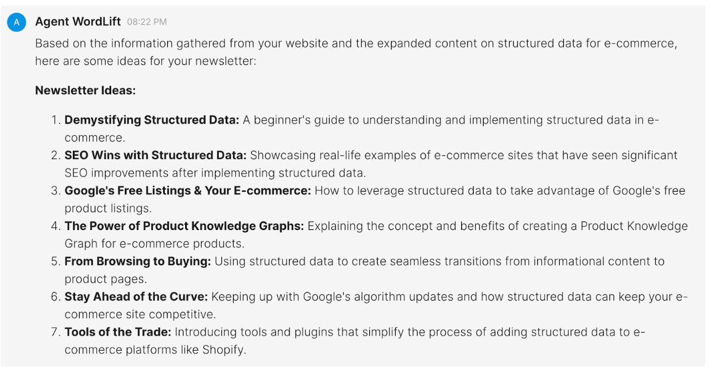
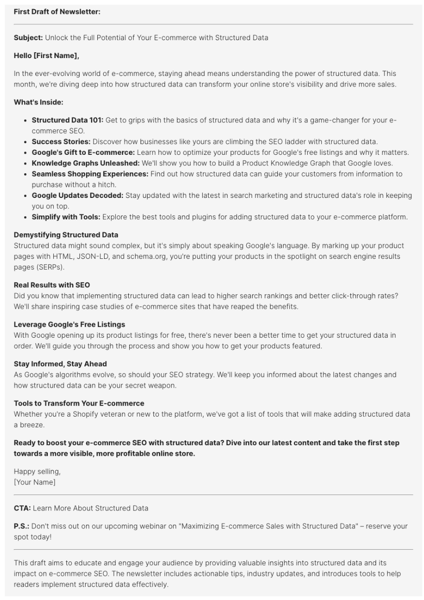

# Ideas for newsletters

This workflow is designed to help us **create a newsletter that engages the target audience** and keeps them informed about a specific topic.

## Generate Ideas and a First Draft

To get things started, we will use this prompt:

```md
I'm looking for ideas on how to write engaging and informative newsletters that will keep the audience in the e-commerce space informed about structured data. Search my website, gather all the information, and present the ideas and a first draft.
```

With this prompt, we define **e-commerce** as a target audience and **structured data** as the main topic.

### Here is what we get:



Within the first response, we will also receive the first draft:


