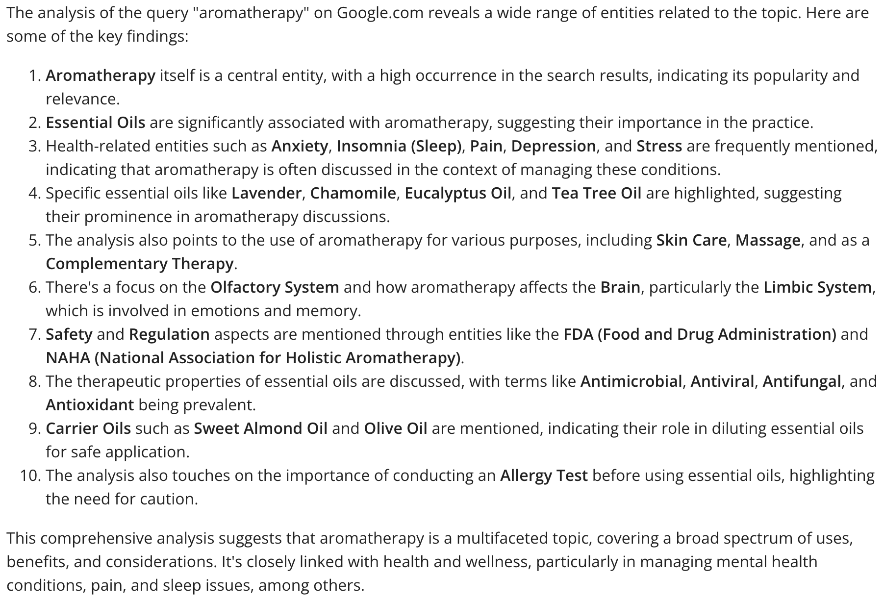

# Keyword Discovery with WordLift AI SEO Agent

Let’s work together on **keyword research** with WordLift AI SEO Agent. Keyword research provides valuable insight into **how a target audience searches on Google**. The insight from these queries helps us inform the content strategy and can also be applied to our day-to-day marketing efforts.

## Query Analysis for Entity Extraction

Let’s combine the query analysis tool to extract the main entities behind each query with keyword suggestions to identify relevant keywords and understand the context and intent behind search queries.

### Example Prompt for Analyzing a Query

> "Analyze the query “natural shower gel” on google.com."

WordLift AI SEO Agent will now use WordLift Content Analysis to understand top-ranking results on google.com. This will shed some light on the context behind this query.

## Deep Dive into Keyword Suggestions

Let’s now dive deeper into keywords (how people are searching on Google) with a different prompt:

> "Now, propose three keyword ideas for 'Natural Shower Gel' for each keyword, provide suggestions, extract the topics, and present all the data in a table highlighting the opportunities."

This approach helps us explore the search landscape more comprehensively, identifying opportunities and understanding user intent.

## Sophisticated Prompt for Blog Post Outline

We can also venture into a more sophisticated prompt that will automatically run the analysis and draft the outline of a blog post:

> "Now, propose three keyword ideas for 'Natural Shower Gel' for each keyword, provide suggestions, extract the topics, and present all the data in a table highlighting the opportunities. I need in the end the outline for a blog post on the keyword that has the highest chance."

This prompt not only seeks keyword opportunities but also aims at creating actionable content strategy outputs, like drafting a blog post outline based on the keyword with the highest potential.

By employing WordLift AI SEO Agent for keyword discovery, we can **gain a competitive edge in content creation**, ensuring that our strategies align with actual search behaviors and audience needs.
