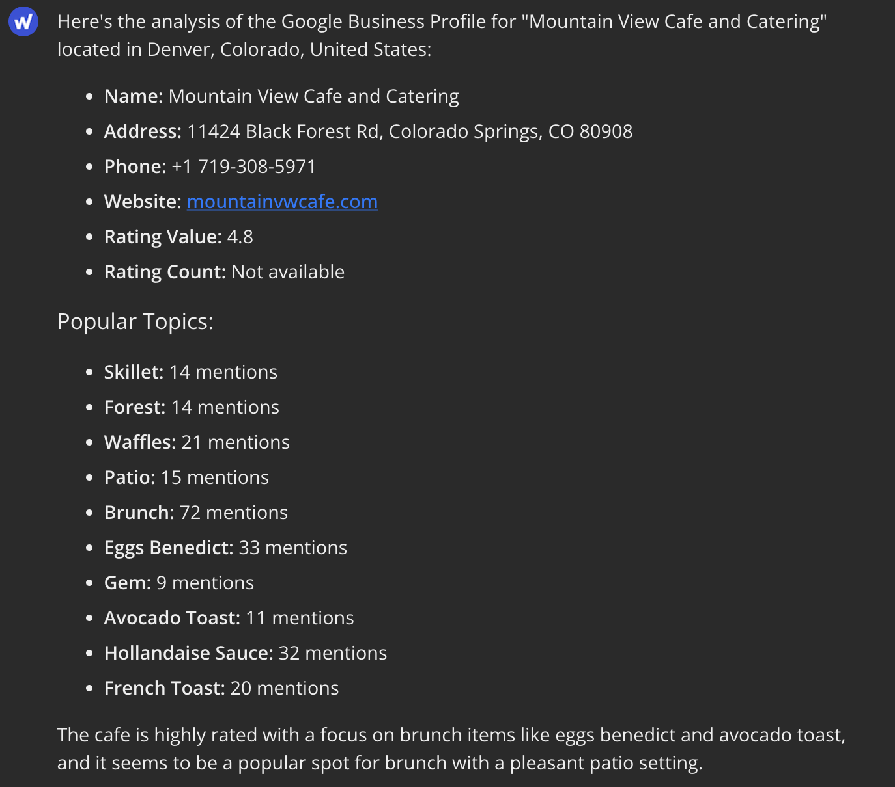
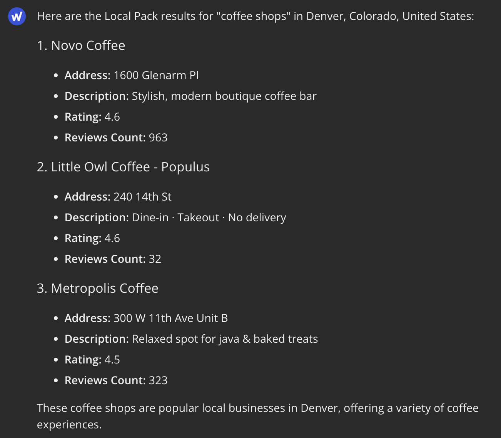
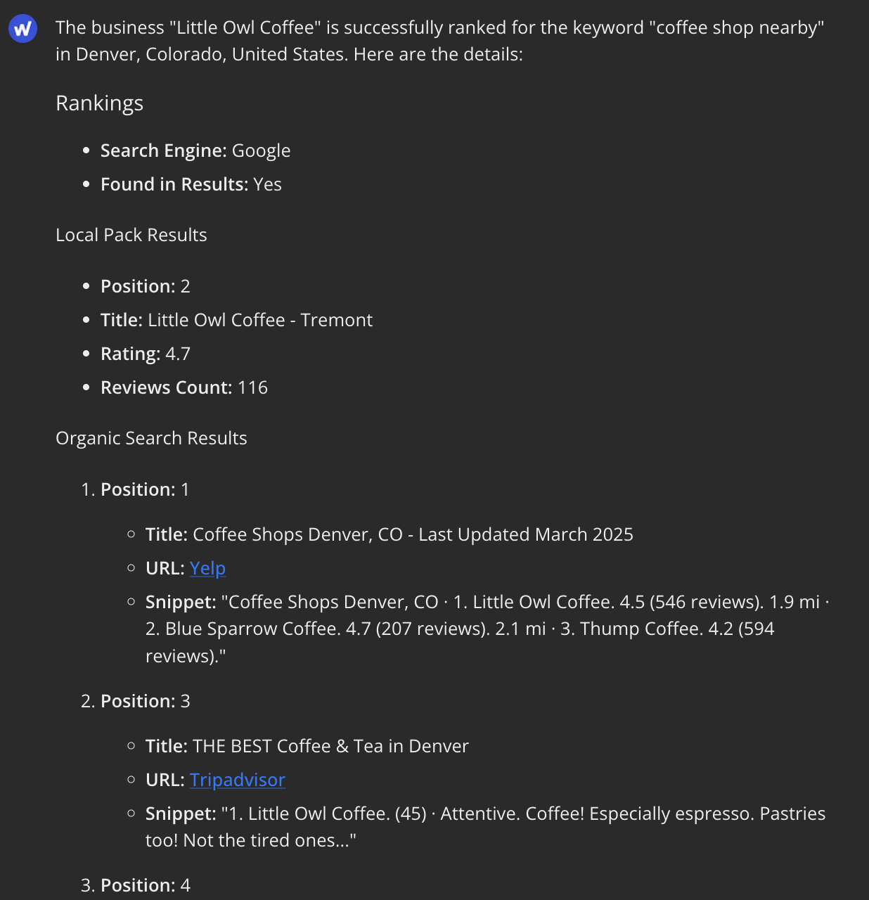
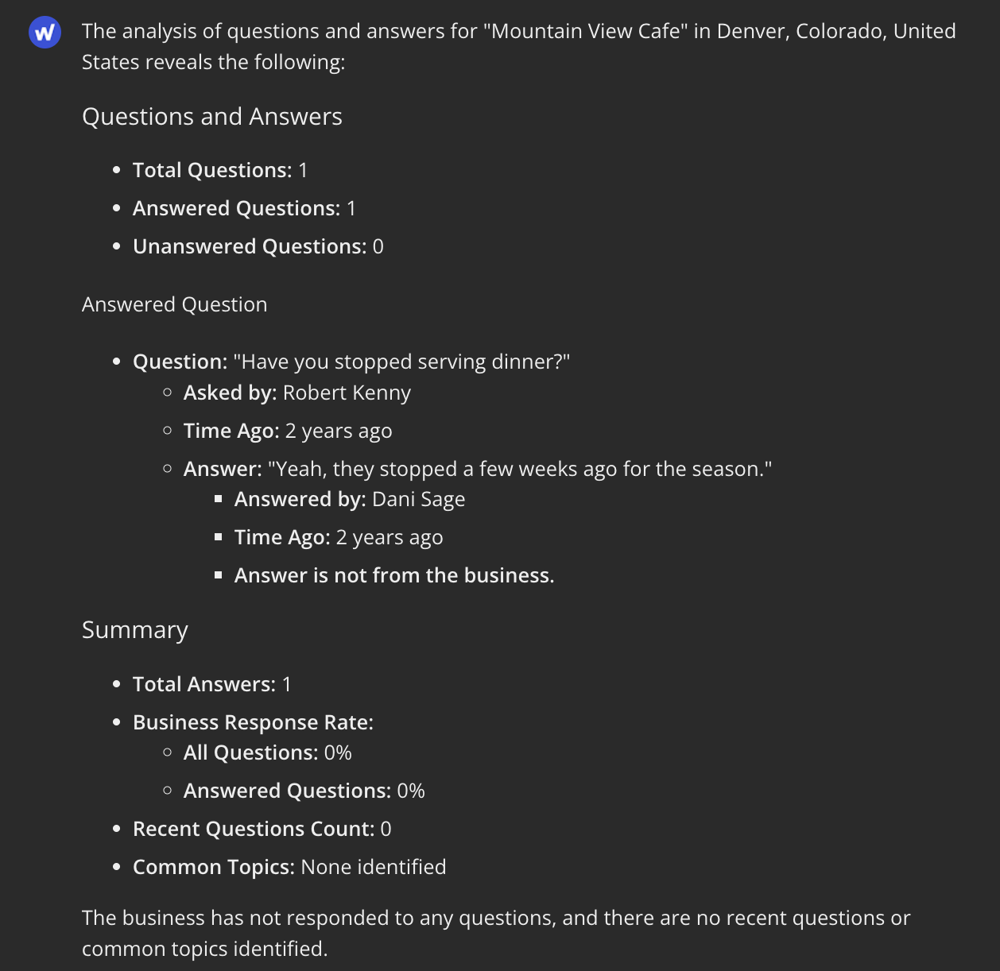

# Optimizing Local Search Performance

Local SEO is critical for businesses that serve specific geographic areas. This workflow demonstrates how to use **Agent WordLift's Local SEO tools** to analyze and optimize your business's local search presence. For more background on local SEO strategies, read our comprehensive guide: [Optimizing Local SEO - How to Create Winning Strategies](https://wordlift.io/blog/en/optimizing-local-seo/).

## Watch the Workflow in Action

Learn how to effectively transform your local search performance with Agent WordLift:

<iframe
  width="100%"
  height="500"
  src="https://www.youtube.com/embed/RfhTZOKT7PE"
  frameborder="0"
  allow="autoplay; encrypted-media"
  allowfullscreen>
</iframe>

## Business Profile Analysis

Start by analyzing your Google Business Profile to understand its current state and identify optimization opportunities.

```md className=wlx-send-to-agent
Analyze the Google Business Profile for "Mountain View Cafe" in "Denver,Colorado,United States"
```

This analysis provides comprehensive information about:

- Basic business information (name, address, phone, website)
- Ratings and review count
- Business hours and attributes
- Categories and popular topics
- Images and additional features



## Local Pack Research

Understanding which businesses appear in Google's Local Pack for relevant keywords helps you identify competitive factors and optimization opportunities.

```md className=wlx-send-to-agent
Show me the Local Pack results for "coffee shops" in "Denver,Colorado,United States"
```

The Agent will return:

- Businesses currently ranking in the Local Pack
- Their ratings and review counts
- Key attributes contributing to their rankings



## Business Ranking Analysis

Track your business's position in both Local Pack and organic search results for important keywords:

```md className=wlx-send-to-agent
Track the rankings of "Little Owl Coffee" for "coffee shop nearby" in "Denver,Colorado,United States"
```

This analysis reveals:

- If your business appears in the Local Pack
- Your position in organic search results
- Snippets shown in search results
- Overall visibility for target keywords



## Customer Q&A Analysis

The questions customers ask on your Google Business Profile provide valuable insights into their needs and interests.

```md className=wlx-send-to-agent
Analyze questions and answers for "Mountain View Cafe" in "Denver,Colorado,United States"
```

This provides:

- All customer questions (both answered and unanswered)
- Analysis of business response patterns
- Common question topics
- Engagement timeline and metrics



## Comprehensive Local SEO Audit

For a complete assessment, combine multiple analyses into a comprehensive audit:

```md className=wlx-send-to-agent
Perform a complete local SEO audit for "Mountain View Cafe" in "Denver,Colorado,United States".
1. Analyze their Google Business Profile
2. Track their rankings for "best coffee shop" and "breakfast cafe"
3. Examine the Local Pack for "coffee shops near me"
4. Review their customer Q&A
5. Provide actionable recommendations for improvement
```

This comprehensive approach delivers a detailed report with actionable insights for improving your local search presence.

## Competitor Analysis

Compare your business against local competitors to identify strengths, weaknesses, and opportunities:

```md className=wlx-send-to-agent
Compare "Mountain View Cafe" with competitors "Little Owl Coffee" and "Mile High Brews" in "Denver,Colorado,United States". Analyze their Google Business Profiles, track their rankings for "coffee shops", and identify competitive advantages.
```

This analysis helps you understand:

- How your profile compares to competitors
- What factors might be helping competitors rank better
- Specific opportunities to improve your competitive position

## Best Practices for Local SEO

Based on the insights gathered, implement these best practices:

1. **Complete Your Business Profile**
   - Ensure all information is accurate and comprehensive
   - Add high-quality photos of your business
   - Select all relevant categories and attributes

2. **Actively Manage Reviews**
   - Respond promptly to all reviews, both positive and negative
   - Thank customers for positive feedback
   - Address concerns professionally in negative reviews

3. **Answer Customer Questions**
   - Monitor and respond to all questions in a timely manner
   - Provide clear, helpful answers that showcase your expertise
   - Use questions to identify information gaps in your profile

4. **Optimize for Local Keywords**
   - Include location-specific terms in your business description
   - Target keywords that show local intent
   - Create content addressing local needs and interests

5. **Maintain Consistent NAP Information**
   - Ensure your Name, Address, and Phone number are consistent across all platforms
   - Verify information on popular directories and citation sites
   - Update all listings when information changes

:::tip
Use the Local SEO tools regularly to monitor your progress and identify new opportunities for optimization. Local search rankings can change frequently, so consistent monitoring is key to maintaining and improving your position.
:::

For detailed information about each Local SEO tool and its capabilities, see our [Local SEO Tools Reference Guide](./local-seo-tools-guide.md).

By following this workflow and implementing the recommended optimizations, you can improve your business's visibility in local search results, attract more relevant customers, and gain an advantage over competitors in your area.
