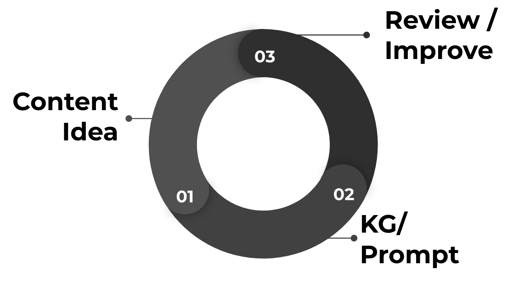
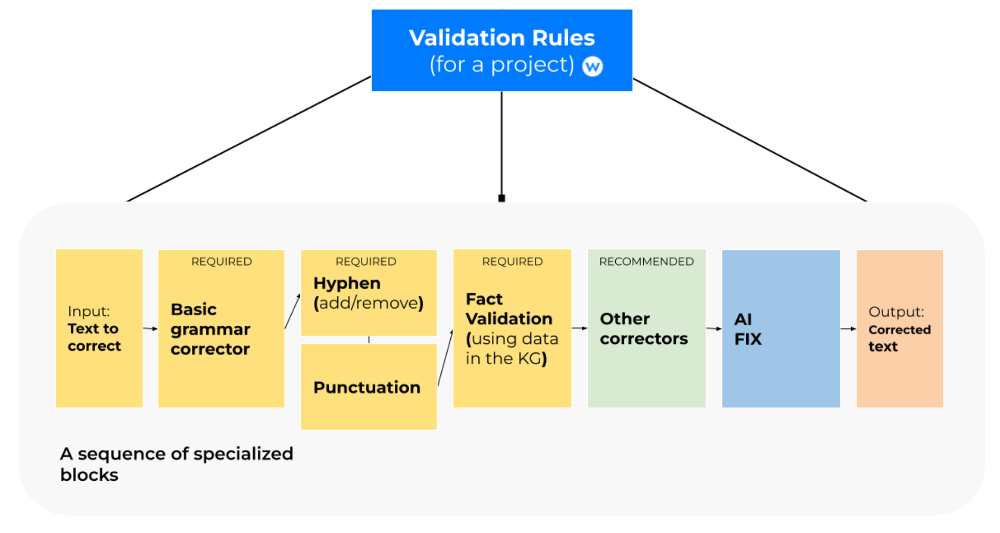
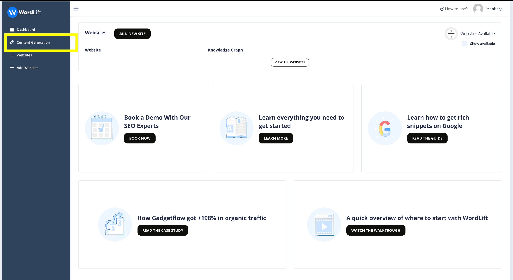
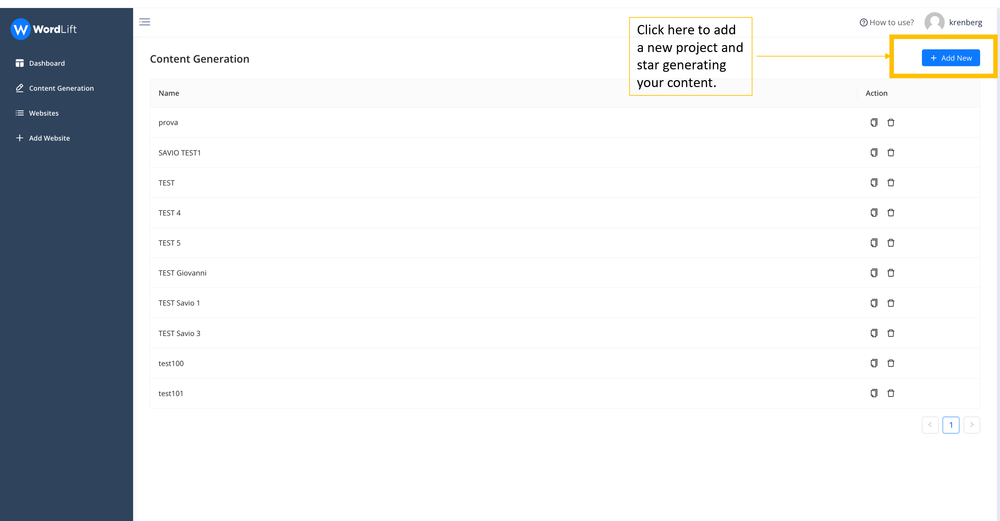
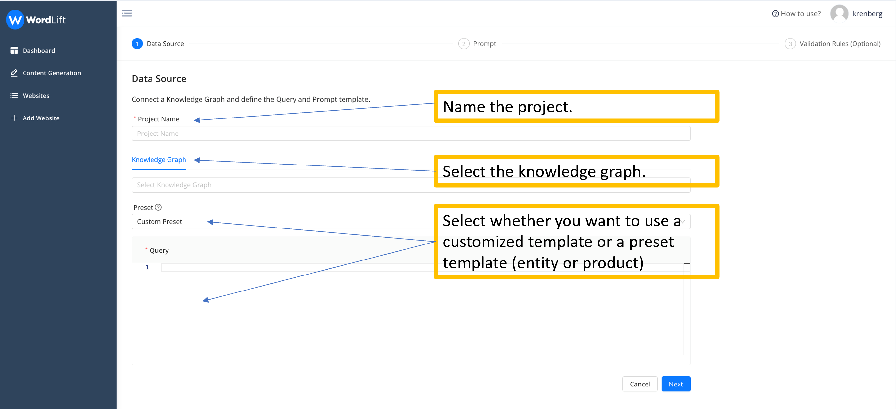
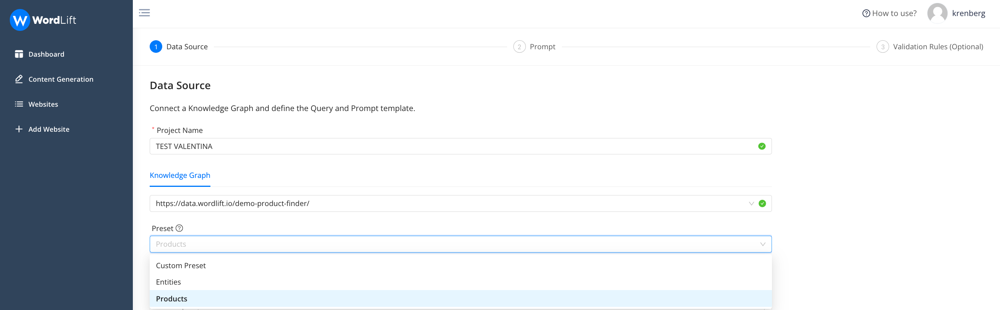
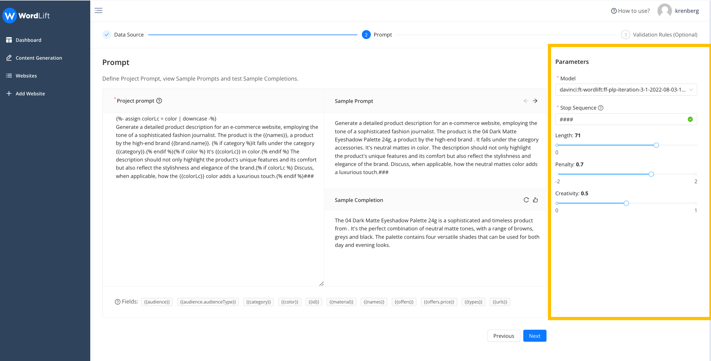
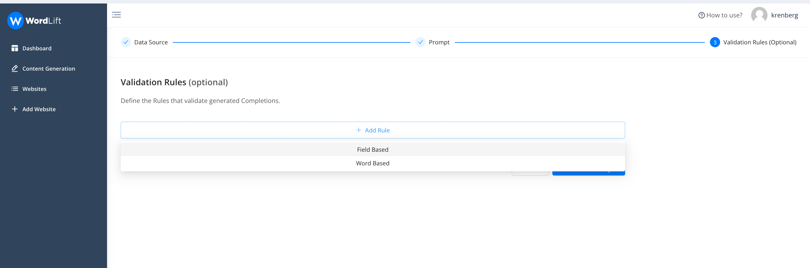
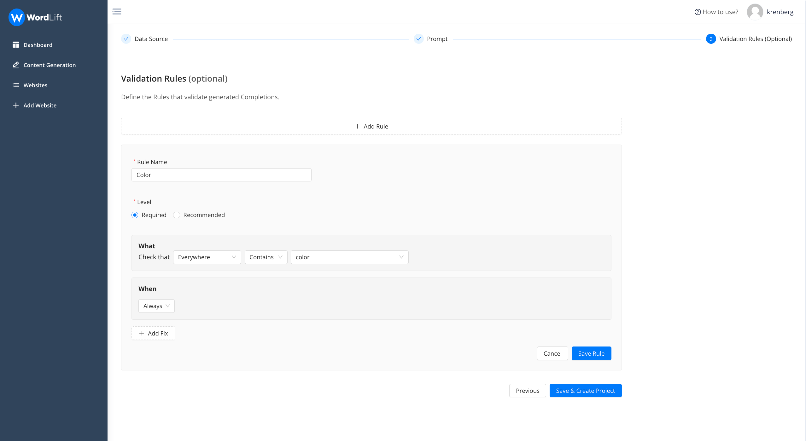
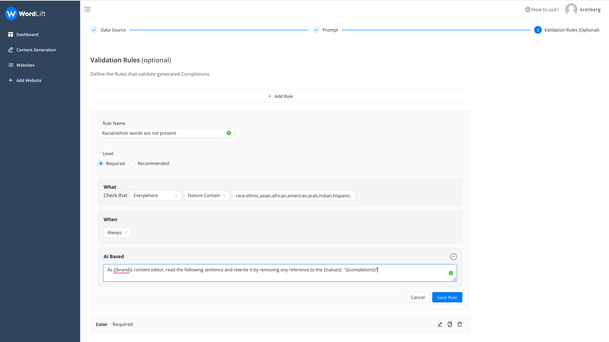

# Content Generation Tool
Welcome to the world of content creation at scale, where challenges abound in harnessing the potential of Large Language Models (LLMs). These powerful language models possess vast knowledge but also suffer from a critical flaw: **they don't know what they know**. However, a solution lies within the data-rich landscape of knowledge graphs. **By leveraging the data within these graphs built using WordLift, we can steer the model's knowledge, curtail hallucinations, and establish a robust validation pipeline**.

At the heart of this transformative content creation process lies an essential tool: **the ontology**. 

By harnessing the power of ontology (or of linked data vocabularies such as schema.org), **we gain the ability to fine-tune and prompt LLMs, significantly enhancing the accuracy of their predictions**.

This dynamic journey begins with a simple content idea, evolving into a sophisticated process of crafting tailored prompts that works best with your data. Drawing from an extensive pool of data available inside the knowledge graphs, **these prompts possess the remarkable potential to generate an infinite array of content variations**, precisely catering to any specific need or context.


*The workflow for creating a prompt template using the attributes in your Knowledge Graph*. 

Furthermore, the implementation of a well-structured **validation pipeline plays a crucial role in the content creation process**. This pipeline serves as a rigorous quality assurance mechanism, allowing us to meticulously examine and fine-tune the output generated by the Large Language Model (LLM). 

As we navigate the landscape of content generation, **the harmonious convergence of knowledge graphs, ontologies (structured data), and LLMs promises to transform how we create content**. It paves the way for more efficient, accurate, and scalable content generation, revolutionizing the possibilities for creative expression and knowledge dissemination in today's dynamic digital world.


# What is the Content Generation Tool? 
WordLift's **Content Generation Tool is a dynamic solution**, engineered to streamline the production of succinct, engaging, and detailed text for a multitude of purposes. Whether you're crafting product descriptions, restaurant profiles, or introductory text for category pages, our tool delivers results you can trust. Developed in close collaboration with editorial teams and SEO professionals from midsize to large organizations, our Content Generation Tool guarantees the generation of high-quality content tailored to meet your **enterprise's specific needs**.

The tool uses a **dynamic [prompt](https://wordlift.io/blog/en/entity/prompt/) generated using the data from your knowledge graph and a fine-tuned model customized** to align with your brand's specific examples. This customization ensures the generated content maintains **a consistent tone and style per your brand's identity**.

The content produced by the tool can be verified for accuracy through **validation rules that you define using the data in your knowledge graph**. This enables you to ensure that the generated content adheres to your company's editorial guidelines and standards, providing content that meets your specific requirements.


*Here is how the validation pipeline works*.


# Get Started 
To get started, log into your dashboard and you'll find '*Content Generation*' on the left. If you click on it, you can use the feature that allows you to **create large-scale content for your website**.




# How it works
Once you click '*Content Generation*' and create the '*New project*', you will arrive at the step-by-step wizard. 




## Step 1 - Selecting Data Source
In this step, you give the project a name and **select the knowledge graph** you want to use. At this point, you will have to extract the data, and thus the attributes, that you will need to create the prompt that you will use later. 



**To extract the data, you will use a GraphQL query**. In the section *Preset*, you can select a template query, using the attributes of schema.org, or you can choose any custom ontology your knowledge graph might use.



Here below is an example query that will extract the following attributes from a Product Knowledge Graph:
- **id**: the unique ID of the product inside the knowledge graph;
- **url**: the url of the associated web page (product description page);
- **material**: the material of the product (here we use strings when constructing the query; as we might have multiple associated materials);
- **names**: the names of the product, also in this case we might have multiple names;
- **description**: the existing description of the product;
- **brand**: the name of the brand (here we can use that the data related to the brand is an additional node in the graph, we use the curly brackets to extract data from a sub-node, in this example we only get the name of the brand);
- **price**: the price of the product.  

We can also see that in **the query below** we’re only getting the top 10 products as we’re limiting the results by passing the page (0) and the number of rows (10) at the beginning of the query. 

```query{
  products(page:0, rows:10) {
    id: iri
	url: strings(name: "schema:url")
	material: strings(name: "schema:material")
	names: strings(name:"schema:name")
    brand: resource(name:"schema:brand"){
    	brand: string(name: "schema:name")
  	}
	price: resource(name:"schema:offers"){
    	price: string(name: "schema:price")}
	}
}
```


## Step 2 - Configuring the prompt
You can **create a dynamic and flexible prompt** using the data you extracted from your knowledge graph. To create your prompt template, you can **use the attributes** that interest you from those you previously selected. We use, as a templating language: [**Liquid**](https://shopify.github.io/liquid/), an open-source language invented by Shopify. Thanks to the template we can for example prevent a section of the prompt from appearing when some attributes are missing in the knowledge graph. Here is an example.

```
As the content writer of a luxury fashion brand write a short but catchy product description for the {{names}}  by revising the following paragraph: 
{{description}}.###
```

Here we make sure that if the description is present we take it into consideration in the prompt (see everything inside the  block. 


Once you have added the attributes, **you can see the template** you have built for your prompt (sample prompt), which allows you to assess whether **the prompt meets your needs** or if you need to improve it in anything. Then **you can select the language model** you want to use. Before going to the next step, you can **set up the configuration parameters** (length, penalty, creativity) of the generation and **see a sample completion**. If you are not satisfied with the outcome, you can make changes, or if that is OK, you can go to the next step. 

The user interface enables you to validate both the prompt and generation settings across multiple data samples. As data can vary, a prompt effective for one product may not necessarily be effective for another. 

We encourage you to **collaborate with our team of specialists to discover the optimal configuration for your specific use-case**. The project you're configuring is designed to be scalable, with potential for reuse across thousands of entities. Also remember, when speaking with our team, that configuration parameters are highly dependent on the model being used for the task. 




## Step 3 - Defining Validation Rules 
We've developed **a flexible validation process** enabling you to establish **customized validation rules** aligning with your specific needs. This ensures the generated content not only meets your expectations but also adheres to your **brand's or company's editorial guidelines**. Furthermore, you gain the ability to dictate when and **how AI should fix the generated content** to maintain compliance with your established rules.

Firstly, decide whether your rule should **be based on a specific data field or a set of words**. We distinguish between validation checks associated with attributes (termed '*Field Based*') and those related to specific words (termed '*Word Based*').



**Let's examine a sample rule**. In this scenario (an e-commerce website), we're scrutinizing the predicted completion (i.e., the generated text) to check for any mention of color, ensuring that it aligns with the color attributes detailed in the knowledge graph. We've also stipulated this rule as a requirement, implying that no content will be considered valid unless it includes an accurate reference to the product's color.



Here are the proposed settings for each and every rule:
1. **Rule Name**: Assign a distinctive name to the rule for easy recognition.
2. **Level**: Choose if the rule is '*required*' or '*recommended*.' If the '*required*' rule is not met, the completion status will show as ERROR. If a '*recommended*' rule isn't fulfilled, it will result in a WARNING status.
3. **What**: Define the specific components or conditions of the rule.
4. **When**: Specify when the rule is active - whether it's always in effect, or only under certain circumstances.

And then “*Save*”.

Let’s add now one more rule, this time “Word Based” to ensure that not ethnic group is mentioned in the generated text.  



In this example we check whether any mentioned term is present in the completion (as you can see multiple terms are separated by comma); the rule will check that the requirement is fulfilled.

If it is not satisfied, it will try to fix the problem using an additional prompt that we have added (Ai Based). See the prompt below:

```
As {{brand}} content editor, read the following sentence and rewrite it by removing any reference to the {{value}}: "{{completion}}"
```

With this rule the system will retry (three or five times depending if it is recommended or required) to **solve the problem**.
Once we have completed all the steps, you can **save the project and start the generation**.


Completions generated are processed and divided into: 
1. **Valid**: This status indicates that the completions have successfully passed the validation process in accordance with the rules you have set previously.
2. **Warning**: This status is assigned to generations that have satisfied 'recommended' rules but have failed to meet 'required' ones.
3. **Error**: This status is given when validation errors occur due to the absence of words or attributes that you had specified to be included. These flawed completions can either be automatically regenerated or manually rewritten and then approved.
4. **Accepted**: This status is applied to all the generations that you have reviewed and confirmed as satisfactory.

Bear in mind that the editor always has the ability to review completions that did not pass validation, and move them to the validated column. Additionally, each completion can be effortlessly regenerated as needed by the system. 

Learn more on how to use the **Content Generation Tool** by [**booking a demo**](https://wordlift.io/book-a-demo/) with our team of experts.
