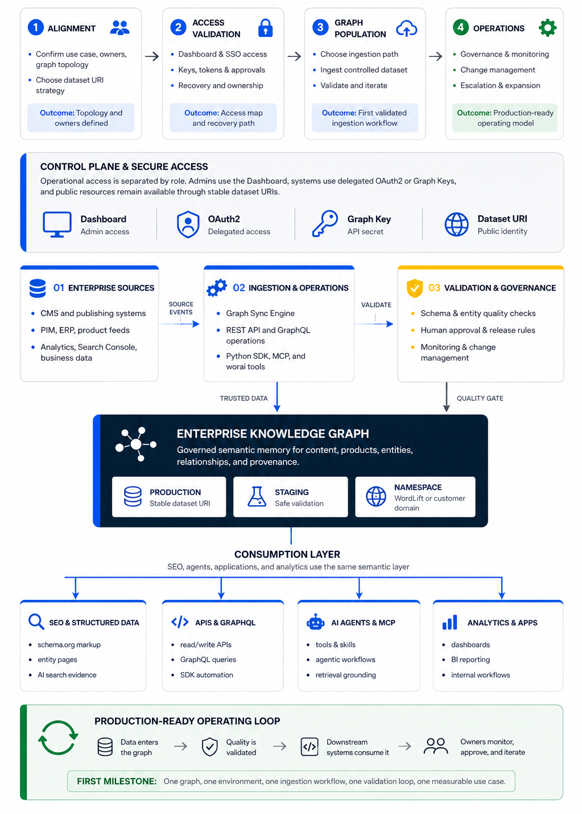

# Enterprise Onboarding Guide

This guide is for Enterprise teams adopting WordLift as part of their semantic SEO, content, data, or AI infrastructure.

It is written for the people who need to make onboarding work in practice: SEO leads, platform engineers, data teams, AI teams, security owners, and executive sponsors. The goal is not only to log in or configure a graph. The goal is to reach a point where the customer team can safely operate a Knowledge Graph, populate it with trusted data, connect it to workflows, and expand it without creating governance or security debt.

## Onboarding outcomes

A successful Enterprise onboarding gives the customer clear answers to these questions:

- Who owns WordLift access, credential storage, and recovery?
- Which Knowledge Graphs belong to the subscription, and which environments do they represent?
- Which domain and dataset URI strategy will be used?
- Which team owns each authentication path, including Dashboard access, SAML SSO, Graph Key or WordLift Key access, OAuth2 Bearer tokens, and third-party authorization?
- Which ingestion path will be validated first?
- What is the first production-ready milestone, and who approves it?

## Phased journey

| Phase | Goal | Customer output |
| --- | --- | --- |
| Alignment | Confirm business use case, owners, graph topology, and environment strategy. | Named owners, first use case, and topology decision. |
| Access validation | Confirm Dashboard access, enterprise SSO requirements, key ownership, and third-party authorization owners. | Access map and recovery path. |
| Graph population | Choose one primary ingestion path and validate it with a controlled dataset. | First ingestion workflow and validation loop. |
| Operations | Define governance, monitoring, change management, escalation, and expansion rules. | Production-ready operating model. |

Enterprise onboarding should be treated as a phased journey rather than a feature checklist. Start narrow, validate quickly, and expand incrementally.

## Enterprise readiness checklist

| Area | Decision | Typical owner | Output |
| --- | --- | --- | --- |
| Business use case | What outcome should the first graph support? | Executive sponsor, SEO lead, product owner | One-sentence success case |
| Subscription ownership | Who owns the Enterprise relationship and escalation path? | Account owner, procurement, sponsor | Named business owner |
| Access ownership | Who can access WordLift and recover access? | Customer admin, identity owner | Admin and backup admin list |
| Graph topology | How many graphs are needed for production, staging, brands, countries, or business units? | SEO lead, data owner, platform owner | Topology worksheet |
| Dataset URI strategy | Will the graph use a WordLift domain or [customer-controlled domain](/enterprise/custom-domain-configuration/)? | Platform owner, DNS owner, SEO lead | Domain decision and DNS owner |
| Ingestion path | Which workflow is validated first? | Data owner, engineering lead, SEO lead | First ingestion path decision |
| Validation loop | How is graph quality checked before production use? | SEO lead, data owner, application owner | Acceptance criteria |

## Graph topology worksheet

Use the smallest graph topology that supports the first use case. Expanding from a clean single-graph or production-staging model is easier than cleaning up fragmented graph architecture later.

| Question | Why it matters | Decision |
| --- | --- | --- |
| Which graph is production? | Prevents accidental testing on live data. | Record the production graph and owner. |
| Is there a staging or sandbox graph? | Supports safer validation and experimentation. | Record the non-production graph and test policy. |
| Are graphs mapped to brands, countries, regions, or business units? | Defines naming, governance, and reporting rules. | Record each mapping and accountable owner. |
| Which dataset URI strategy is used? | Affects linked data, integrations, structured data, and long-term namespace ownership. | Choose WordLift-hosted or [customer-controlled domain](/enterprise/custom-domain-configuration/). |
| Who owns DNS and domain changes? | Custom domains require customer-side ownership and coordination. | Record DNS owner and approval path. |

For the recommended population workflow and a comparison of specialized alternatives, see [Create a Knowledge Graph](/knowledge-graph/create-a-knowledge-graph/).

## Access and credential ownership

Treat access as operational infrastructure, not as a personal account owned by one individual.

| Access type | Purpose | Typical owner | Where it is used | Secret or source handling | Lifecycle or approval question | Canonical route |
| --- | --- | --- | --- | --- | --- | --- |
| Dashboard access | Human access to subscription and graph configuration. | Customer admin, SEO lead, account owner | WordLift Dashboard at `https://my.wordlift.io` | Managed through customer-approved admin process. | Who is primary admin, backup admin, and recovery contact? | Contact the WordLift account team if access is missing. |
| SAML SSO | Enterprise identity and centralized access governance. | Identity owner, security owner | Enterprise login flow | Managed by the customer's identity provider. | Is SSO required, and who owns IdP configuration and access review? | [SAML Single Sign-On](/enterprise/saml-sso/) |
| Graph Key / WordLift Key | Programmatic access to graph-backed APIs and automation. | Platform, data, or engineering owner | API, GraphQL, SDK, MCP, automation, and selected tools | Store only in a customer-approved secret manager. Use `Authorization: Key ...` where product docs require Key authentication. | Who can retrieve, rotate, revoke, and audit key use? | [GraphQL support](/api/graphql/graphql-support/) and [Monitoring API Guide](/developer-resources/monitoring/) |
| OAuth2 Bearer tokens | Delegated access for product-specific APIs and workflows. | Identity owner, application owner, system owner | Product-specific APIs that require Bearer tokens | Use the identity and security pattern approved by your organization. | Which application owner approves the flow, scopes, token storage, and revocation path? | Follow the relevant product documentation after your identity and security owners approve the pattern. |
| Third-party service authorization | Authorization to external services such as Google Search Console. | Service owner, analytics owner, security owner | Analytics, search, or connector workflows | Authorized by the external service owner through the current product or support path. | Who owns the third-party account, scopes, consent, and revocation? | See [Data Sources](/knowledge-graph/data-sources-oauth2/) for Dashboard and API connector setup, and [Analytics API](/knowledge-graph/analytics-api/) for product-specific implementation details. |

## Security operating rules

Use these rules before any production integration:

- Store Graph Keys, WordLift Keys, tokens, and third-party credentials in a customer-approved secret manager.
- Do not expose keys in client-side code.
- Do not store keys in documentation, tickets, chat threads, shared spreadsheets, or repositories.
- Separate staging and production credentials when environments are separate.
- Name the owner who can rotate, revoke, and audit each credential.
- Define a periodic access review before production use.
- Define a break-glass or admin recovery path for Dashboard and SSO access.
- Confirm the identity provider owner, MFA expectations, and role or group mapping when SAML SSO is required.
- Confirm third-party service authorization with the actual service owner before connecting analytics or search data.

## First ingestion path

Choose one primary ingestion path for the first phase. Multiple paths can coexist later, but onboarding should prove one path first.

| Customer situation | Better starting point | Validation output | Canonical route |
| --- | --- | --- | --- |
| Website or content platform | GraphSync | A controlled pilot with validated entities, relationships, and stable identities | [GraphSync](/knowledge-graph/graphsync/) |
| Google Merchant Center product catalog | Product Knowledge Graph Builder | A validated product subset synchronized from the selected feed | [Product Knowledge Graph Builder](/product-knowledge-graph-builder/introduction/) |
| WordPress editorial workflow | WordPress Plugin | Editors can create, annotate, and publish the agreed entity model | [WordPress Plugin](/wordpress-plugin/) |
| Existing Botify crawl workflow | Botify Crawl Import | Selected crawl fields are mapped and written to the graph | [Botify Crawl Import](/knowledge-graph/botify/) |
| Customer-owned entity model and lifecycle | Direct API or SDK integration | A repeatable write and validation process owned by the customer team | [Create a Knowledge Graph](/knowledge-graph/create-a-knowledge-graph/) |

GraphSync is the recommended general path for Business+ and Enterprise content graphs. Sitemap Import and Web Page Import are limited page-oriented tools, while GraphQL, analytics, monitoring, and publishing services operate on or around a graph rather than replacing its primary population workflow.

## Production-ready milestone

The first meaningful milestone is not only the creation of a graph. A graph can exist before it is useful.

A production-ready milestone proves that:

- trusted data enters the graph through one approved workflow;
- the customer validates graph quality with an agreed method;
- at least one downstream system, report, content workflow, or AI workflow can consume the result;
- owners are clear for access, credentials, data quality, and escalation;
- staging and production behavior are separated where needed;
- the next expansion step is understood and intentionally scoped.

Example milestone:

> The staging graph receives product data from the source system, exposes validated entities through the dataset URI, and supports one downstream GraphQL query used by the application team.

## Suggested first-week plan

| Timeframe | Owner | Activity | Output | Done when |
| --- | --- | --- | --- | --- |
| Day 1 | Account owner, customer admin | Confirm Dashboard access, subscription owner, primary admin, backup admin, and escalation path. | Access ownership record | Admin and recovery path are documented. |
| Day 2 | SEO lead, platform owner, data owner | Confirm graph topology, environments, and dataset URI strategy. | Topology worksheet | Production and non-production graph decisions are recorded. |
| Day 3 | Security owner, identity owner, platform owner | Validate credential ownership, SAML needs, key storage, OAuth ownership, and third-party authorization owners. | Credential ownership matrix | Every access path has an owner and lifecycle question answered. |
| Day 4 | Engineering lead, data owner, SEO lead | Select the first ingestion path and smallest test dataset. | First ingestion decision | One path is selected and unnecessary parallel paths are deferred. |
| Day 5 | Business owner, data owner, application owner | Define first validation loop and production-ready milestone. | Acceptance criteria | Owners agree what production-ready means for the first use case. |

## Canonical resources

- [Knowledge Graph](/knowledge-graph/)
- [Custom Domain Configuration](/enterprise/custom-domain-configuration/)
- [GraphQL support](/api/graphql/graphql-support/)
- [Monitoring API Guide](/developer-resources/monitoring/)
- [Data Sources](/knowledge-graph/data-sources-oauth2/) - Dashboard and API connector setup
- [Analytics API](/knowledge-graph/analytics-api/) - product-specific implementation details
- [Content Generation API Guide](/content-generation/api-guide/) - product-specific implementation details
- [worai install](/worai/install/)
- [worai configuration](/worai/configuration/)
- [SAML Single Sign-On](/enterprise/saml-sso/)
