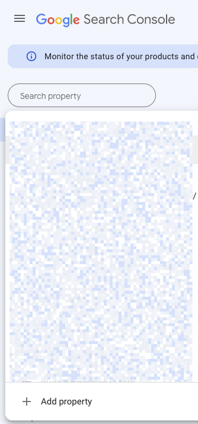
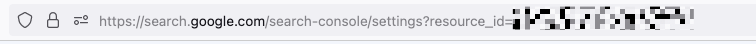
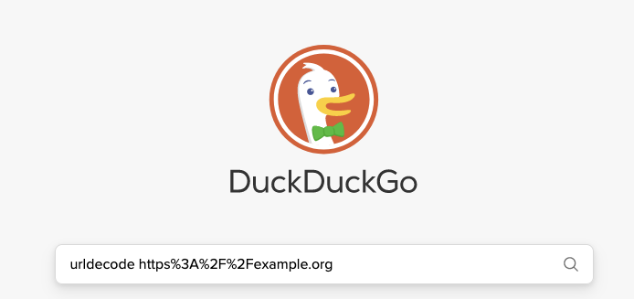
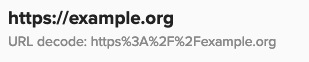
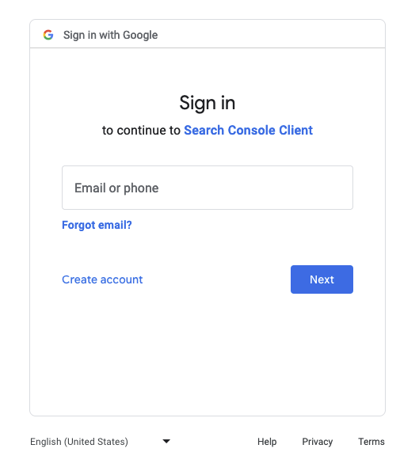
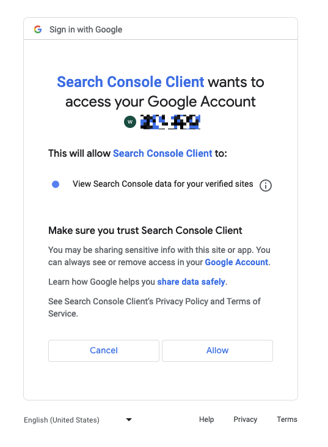

# Analytics API

## Introduction

To import analytics data, use the Analytics API, following these steps:

1. Connect the Google Search Console to your Knowledge Graph (Botify is also supported as an alternative to Google Search Console, [inquire with us](https://wordlift.io/contact-us/)).
1. Run the Analytics Import. 

## Authorization

:::info

Using the Analytics API requires a WordLift Key. If you're unsure which one is the WordLift Key for an account, go to [my.wordlift.io](https://my.wordlift.io) and scroll through the list of websites.

:::

## Connect Google Search Console

In order to connect the Google Search Console to your Knowledge Graph, a client needs to perform an interactive authentication and authorization process with Google by using a Web Browser.

### Determine the Resource Id {#determine-the-resource-id}

Each website or domain in Google Search Console has a resource ID. The resource ID is required to configure the Analytics API properly.

To retrieve the resource ID open the [Google Search Console](https://search.google.com/search-console) and select the desired website or domain from the left:



Then select the `resource_id` value:



The value is URL encoded, and it requires to be decoded. [DuckDuckGo](https://duckduckgo.com) provides a handy way to decode a URL:



Take note of the decoded resource ID, it will be used later (in this example `https://example.org`):




### Create an Authorization URI

The process starts using a specially crafted URL. To get the URL use the "Build Authorization URI" API (replace `<key>` with your WordLift Key):

```sh
curl -X "POST" "https://api.wordlift.io/google-search-console/oauth2/authorize-uris" \
     -H 'Authorization: Key <key>' \
     -H 'Content-Type: application/json; charset=utf-8' \
     -d $'{
  "redirect_uri": "https://developers.google.com/oauthplayground"
}'
```

:::warning

The `redirect_uri` must be set to `https://developers.google.com/oauthplayground`.

:::

This will yield the following response:

```json
{
  "authorize_uri": "https://accounts.google.com/o/oauth2/v2/auth?redirect_uri=https%3A%2F%2Fdevelopers.google.com%2Foauthplayground%2F&prompt=consent&response_type=code&client_id=615875160260-bsbm4u5fb2hrke3ln89n33v8rmmksth9.apps.googleusercontent.com&scope=https%3A%2F%2Fwww.googleapis.com%2Fauth%2Fwebmasters.readonly&access_type=offline"
}
```

Open the above URL in a Web Browser.

### Authenticate and Authorize with Google

When requested provide your Google e-mail address. The account must be able to access the Google Search Console for the target account:



Then provide the password and complete authentication:


If requested, provide a 2-Step Verification code:


Then finally click "Allow" to authorize the Analytics API to access the Google Search Console data:



After clicking "Allow", the browser is redirected to a URL like this:

```
https://developers.google.com/oauthplayground/?code=<authorization-code>&scope=https://www.googleapis.com/auth/webmasters.readonly
```

Copy the value in `code=<authorization-code>` (the `<authorization-code>` part) to use it with the Exchange Authorization Code API.

### Create an Authorization Code Exchange

Send the `authorization-code` to the Exchange Authorization Code API:

```sh
curl -X "POST" "https://api.wordlift.io/google-search-console/oauth2/auth-code-exchanges" \
     -H 'Authorization: Key <key>' \
     -H 'Content-Type: application/json; charset=utf-8' \
     -d $'{
  "code": "<authorization-code>",
  "google_search_console_resource_id": "<resource_id>"
}'

```

:::tip

If you don't know the resource ID, see [how to determine the resource ID](#determine-the-resource-id).

:::

If successful, the access token will be stored in the platform and the API will return an empty JSON object:

```json
{
  "scope": "https://www.googleapis.com/auth/webmasters.readonly",
  "access_token": "<access-token>",
  "expires_in": 3599,
  "token_type": "Bearer",
  "refresh_token": "<refresh-token>"
}
```

## Connect Botify

Botify is also supported as an alternative to Google Search Console, [inquire with us](https://wordlift.io/contact-us/).

:::note

You can only connect one platform at a time.

:::

## Update the Account with the URL

The last step before calling the Analytics import is to configure the website URL:

```sh
## Update Accounts
curl -X "PUT" "https://api.wordlift.io/accounts?key=<key>&url=<url>&country=<country>&language=<language>" \
     -H 'Authorization: Key <key>' \
     -H 'Accept: application/json' \
     -H 'Content-Type: application/x-www-form-urlencoded; charset=utf-8'
```

Set the following parameters:

* `key`: is the WordLift key associated with the account
* `url`: is the URL of the target website (in the example above `https://example.org`)
* `country`, optional: the 2 letters country code, e.g. `US`
* `language`, optional: the 2 letters langauge code, e.g. `EN`

If successful the API will response with 200 and the following JSON:

```json
{
  "datasetURI": "https://data.example.org/dataset/",
  "packageType": "<your-package-type>"
}
```

## Call the Analytics Import

Calling the Analytics import is as simple as submitting the following request:

```sh
curl -X "POST" "https://api.wordlift.io/analytics-imports" \
     -H 'Authorization: Key <key>' \
     -H 'Content-Type: application/json'
```

Replace `<key>` with your WordLift key. The API will import the analytics data for all the URLs published in the Knowledge Graph.