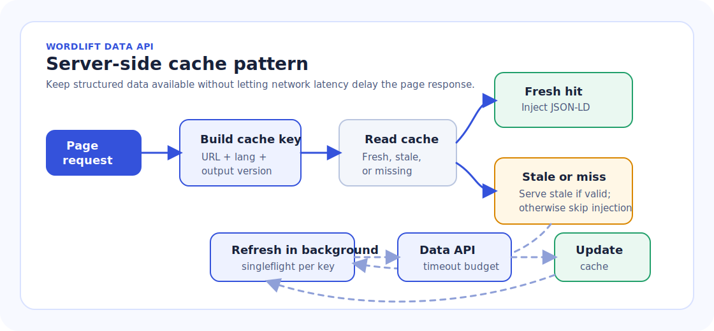

# Data API

The Data API publishes the structured data for a web page from the WordLift Knowledge Graph.

Use it when you need to retrieve the JSON-LD that WordLift has generated for a URL and inject it into the page HTML. The response is standard JSON-LD, compatible with RDF tooling and schema.org consumers.

If you already use the client-side WordLift Cloud API and want to move JSON-LD injection to your rendering layer, see [Migrate from Client-Side API to Server-Side API](./migrate-client-side-to-server-side-data-api.md).

## Ways to inject structured data

There are two injection locations: client-side and server-side. Server-side integrations can refresh their cache during a page request or through an out-of-band process.

### Client-side with WordLift Cloud

WordLift Cloud loads `bootstrap.js` in the browser. The script detects the current page URL, fetches the structured data from the Data API, and injects it into the page as JSON-LD.

Use this option when you can add a script to the page but do not control the server-side rendering pipeline.

See [Install the WordLift Cloud script](../cloud/index.md) for the full setup.

### Server-side rendering

Server-side rendering fetches the Data API response from your server, static-site generator, edge function, or application framework before the HTML is returned to the user.

Use this option when you control the page rendering pipeline and want the JSON-LD to be present in the initial HTML response.

For a Cloudflare edge example, see [Cloudflare Integration](./cloudflare-integration.md).

### Server-side with out-of-band cache prefill

When canonical URLs are known and daily freshness is acceptable, a scheduled process can fetch and validate Data API responses before they are needed. The renderer then reads JSON-LD only from a shared application cache, keeping Data API requests outside the page-rendering path.

See [Out-of-Band Data API Cache Prefill](./out-of-band-data-api-cache.md) for the recommended 24-hour refresh schedule, 30-hour cache TTL, Next.js use case, and failure behavior.

### Choosing client-side or server-side injection

With the client-side WordLift Cloud integration, JSON-LD is added to the rendered DOM after the browser executes `bootstrap.js`. It is not present in the initial server-rendered HTML response.

This works for crawlers that render JavaScript, including Googlebot. However, AI crawlers, LLM-based retrieval systems, and agentic tools do not all process pages in the same way. Some render JavaScript, some rely on search engine indexes, some consume APIs or structured endpoints, and some inspect only the raw HTML response.

When AI search visibility, AEO, GEO, or access by non-JavaScript crawlers is a primary requirement, prefer server-side rendering. Server-side rendering makes the JSON-LD available in the HTML returned by the server, without requiring the consumer to execute JavaScript.

Client-side injection remains useful when implementation speed and minimal application changes are the priority, or when the main consumer is known to render JavaScript. For broad machine discovery, server-side injection plus the machine-readable Knowledge Graph exposed through the Data API provides the stronger default.

The server-side flow is:

1. Determine the canonical URL of the page being rendered.
2. Build the Data API URL for that page.
3. Fetch the Data API response.
4. Serialize the response as JSON.
5. Inject it into the page inside a `script` tag with `type="application/ld+json"`.

```html
<script type="application/ld+json">
{
  "@context": "https://schema.org",
  "@type": "WebPage",
  "@id": "https://data.example.org/entity/page",
  "url": "https://example.org/page.html",
  "name": "Example page"
}
</script>
```

When using server-side rendering, avoid building JSON-LD with string concatenation. Parse the Data API response as JSON, then serialize it with the JSON tools provided by your runtime.

#### Next.js server-side example

In Next.js, fetch the Data API response during server rendering and render it in the page as an `application/ld+json` script.

:::warning Example only

The following snippet demonstrates where JSON-LD injection happens in a Next.js page. It is not production-ready: it does not implement the full caching, fallback, background refresh, cache stampede protection, or observability requirements described in [Performance and caching](#performance-and-caching).

Do not make production page rendering depend directly on an uncached Data API request.

:::

```tsx
function toWordLiftDataApiUrl(pageUrl: string) {
  const url = new URL(pageUrl);
  return `https://api.wordlift.io/data/${url.protocol.replace(":", "")}/${url.host}${url.pathname}${url.search}`;
}

async function getJsonLd(pageUrl: string) {
  const response = await fetch(toWordLiftDataApiUrl(pageUrl), {
    next: { revalidate: 3600 },
    signal: AbortSignal.timeout(1500),
  });

  if (!response.ok) {
    return null;
  }

  return response.json();
}

function serializeJsonLd(jsonLd: unknown) {
  return JSON.stringify(jsonLd).replace(/</g, "\\u003c");
}

export default async function Page() {
  const pageUrl = "https://www.example.com/example-page";
  const jsonLd = await getJsonLd(pageUrl);

  return (
    <>
      {jsonLd ? (
        <script
          type="application/ld+json"
          dangerouslySetInnerHTML={{ __html: serializeJsonLd(jsonLd) }}
        />
      ) : null}
      <main>{/* Page content */}</main>
    </>
  );
}
```

Adapt the canonical URL construction to your routing model, locale handling, and canonical URL policy. If the site is multilingual, append `__wl_lang` as described in [Multilingual requests](#multilingual-requests).

#### Performance and caching

WordLift strives to provide the fastest response possible from the Data API, with a target response time under 200 ms. This is a performance target, not a guaranteed response time: network conditions, cache state, routing, and other runtime factors can still affect latency.

:::warning

Do not make the page response depend on an uncached Data API call with no timeout or fallback. If the Data API response is delayed and no acceptable cached data exists, return the page without JSON-LD rather than delaying the response sent to the user.

:::

For server-side integrations that refresh during page requests, use a stale-while-revalidate pattern. If the application instead refreshes a bounded URL inventory on a schedule, use [Out-of-Band Data API Cache Prefill](./out-of-band-data-api-cache.md).



1. Build a cache key from the normalized canonical URL, `__wl_lang` when present, and the expected output format or version. A typical normalization policy lowercases the host, removes fragments, applies one trailing-slash rule, and sorts or removes non-canonical tracking query parameters.
2. Read structured data from the cache before calling the Data API.
3. If fresh cached data exists, inject it immediately.
4. If only stale cached data exists, inject it only when it is still within your maximum accepted stale age.
5. If there is no acceptable cached data and the Data API does not return within the page budget, skip JSON-LD injection for that response and log the miss.
6. Refresh the Data API data outside the critical rendering path when the platform supports it, for example in a worker, background task, asynchronous job, or detached refresh.
7. Use one refresh per cache key at a time, and throttle refresh attempts to avoid repeated API calls during traffic spikes.
8. Update the cache when the Data API response returns, so future requests can use fresh data.

Apply separate limits for:

- the maximum time the page renderer may wait for structured data;
- the Data API fetch timeout;
- the fresh cache TTL;
- the maximum stale age after which cached data must no longer be injected.

Track cache hit rate, stale response usage, cache misses, timeout rate, refresh failures, refresh latency, and the age of cached data served. These metrics make it easier to tune the thresholds without affecting user-facing performance.

## API URL format

The Data API endpoint is:

```text
https://api.wordlift.io/data/{page-url}
```

The `{page-url}` part is the full page URL rewritten as a path after `/data/`. Replace `https://` with `https/` and `http://` with `http/`.

For example, this page URL:

```text
https://example.org/page.html
```

becomes:

```text
https://api.wordlift.io/data/https/example.org/page.html
```

Include the complete path and query string when they are part of the canonical page URL.

If the page URL contains spaces, non-ASCII characters, or reserved characters inside query values, encode those parts as a valid URL before appending the URL to the Data API path.

## Multilingual requests

Use the `__wl_lang` query parameter to request structured data for a specific language.

```text
https://api.wordlift.io/data/https/example.org/page.html?__wl_lang=en
```

The value is the ISO 639-1 two-letter language code, such as `en` for English or `it` for Italian.

When `__wl_lang` is provided, the Data API uses it to select the graph that is authoritative for that language and URL. See [Multilingual](./multilingual.md) for multilingual graph routing details.

## Output format

The Data API returns JSON-LD.

JSON-LD is JSON for Linked Data. It can be consumed directly by search engines as structured data and can also be parsed as RDF by tools that support JSON-LD.

Use the standard JSON-LD or RDF parsing APIs provided by your runtime library when converting the response to RDF datasets, triples, or another RDF serialization.

Typical output includes:

- a `@context`, usually schema.org;
- one or more schema.org entities;
- stable entity identifiers in `@id`;
- page-level properties such as `url`, `name`, `headline`, `description`, or relationships to related entities.

For HTML pages, inject the response inside:

```html
<script type="application/ld+json">
...
</script>
```

## Sample response

```json
{
  "@context": "https://schema.org",
  "@graph": [
    {
      "@type": "WebPage",
      "@id": "https://data.example.org/entity/page",
      "url": "https://example.org/page.html",
      "name": "Example page",
      "about": {
        "@id": "https://data.example.org/entity/example-topic"
      },
      "publisher": {
        "@id": "https://data.example.org/entity/example-organization"
      }
    },
    {
      "@type": "Thing",
      "@id": "https://data.example.org/entity/example-topic",
      "name": "Example topic",
      "sameAs": [
        "https://www.wikidata.org/wiki/Q1492"
      ]
    },
    {
      "@type": "Organization",
      "@id": "https://data.example.org/entity/example-organization",
      "name": "Example Organization",
      "url": "https://example.org/"
    }
  ]
}
```

The exact entities and properties depend on the data available in the Knowledge Graph for the requested URL.

## Parsing JSON-LD and RDF

Treat the response as structured JSON-LD, not as text to modify with regular expressions or string replacement.

Use a JSON-LD or RDF library when you need to compact, expand, validate, transform, query, convert to RDF triples, or merge the response with other linked data.

Useful references:

- [JSON-LD](https://json-ld.org/)
- [jsonld.js](https://github.com/digitalbazaar/jsonld.js) for JavaScript and Node.js
- [RDFLib.js](https://github.com/linkeddata/rdflib.js) for JavaScript RDF workflows
- [RDFLib](https://rdflib.readthedocs.io/) for Python
- [Apache Jena](https://jena.apache.org/) for Java and JVM applications
