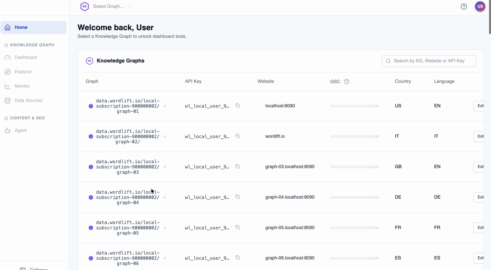
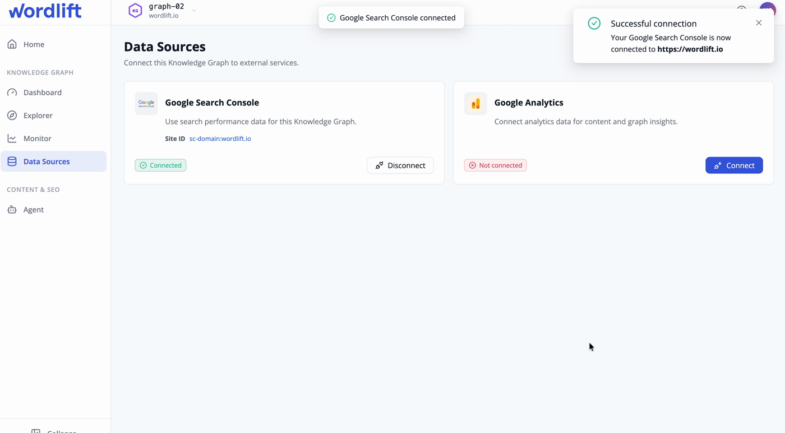

# Data Sources: OAuth2 Connections

Data Sources connect a WordLift account to external platforms that require OAuth2 authorization. Use them to authorize services such as search and analytics providers once, then use the connected data in WordLift Dashboard workflows and API-driven integrations.

The Dashboard and the Manager API use the same connector model. A source connected from the Dashboard is visible through the API, and an API-managed connection can support Dashboard workflows for the same account.

Data Sources are designed for workflows where WordLift needs permissioned provider data to enrich account configuration, support analytics imports, inspect search performance, or power downstream integrations. Instead of managing provider tokens manually, teams can connect a source through the Dashboard or initiate the same OAuth2 flow through the API, then store the source-specific configuration on the WordLift account.

## What Data Sources enable

Use OAuth2 Data Sources when you need to:

- connect search and analytics providers to a WordLift account;
- let account owners complete provider consent from the Dashboard;
- start the same authorization flow from a custom application or onboarding tool;
- verify whether an account is connected to a provider;
- store provider-specific selections, such as a site, property, or data stream;
- reuse the same authorized source across Dashboard and API workflows.

## Use Data Sources in the Dashboard

Open the WordLift Dashboard at [my.wordlift.io](https://my.wordlift.io), select the account or graph you want to configure, then open **Data Sources**.



From the Data Sources section you can:

- review the sources available for the selected account;
- start the OAuth2 authorization flow for a source;
- complete provider consent in the provider's authorization screen;
- check whether the source is connected;
- configure source-specific fields, such as a selected site, property, or data stream;
- disconnect a source when it should no longer be used.

The provider controls the consent screen and the permissions granted to WordLift. If a source does not show the expected site or property after authorization, verify that the provider account used for consent has access to that resource.



## Use Data Sources through the API

Use the Manager API when you need to integrate Data Sources into your own provisioning, onboarding, or account-management workflow.

The generic OAuth2 connector flow is:

1. List available connectors with [`GET /oauth2/connectors`](/api/manager/connectors/).
2. Create an authorization request with [`POST /accounts/{account_id}/oauth2/connectors/{connector_id}/authorization-requests`](/api/manager/create-authorization-request/).
3. Redirect the user to the provider authorization URL returned by the API.
4. Check the account authorization status with [`GET /accounts/{account_id}/oauth2/connectors/{connector_id}/authorization`](/api/manager/authorization/).
5. Read source-specific fields with [`GET /accounts/{account_id}/oauth2/connectors/{connector_id}/fields`](/api/manager/fields/).
6. Save a source-specific field with [`PUT /accounts/{account_id}/oauth2/connectors/{connector_id}/fields/{field_name}`](/api/manager/put-field/).
7. Disconnect the source with [`DELETE /accounts/{account_id}/oauth2/connectors/{connector_id}/authorization`](/api/manager/delete-authorization/).

Use the connector identifiers returned by `GET /oauth2/connectors`. Do not hard-code provider assumptions unless the connector is part of a controlled integration that you own.

### Authorization request

Create an authorization request for the account and connector:

```sh
curl -X POST "https://api.wordlift.io/accounts/{account_id}/oauth2/connectors/{connector_id}/authorization-requests" \
  -H "Authorization: Bearer <access_token>" \
  -H "Content-Type: application/json" \
  -d '{
    "redirect_uri": "https://example.org/oauth2/callback"
  }'
```

The response contains the provider authorization URL. Open or redirect the user to that URL to complete the OAuth2 consent flow.

### Authorization status

Check whether the account has an active authorization for a connector:

```sh
curl "https://api.wordlift.io/accounts/{account_id}/oauth2/connectors/{connector_id}/authorization" \
  -H "Authorization: Bearer <access_token>"
```

Use the response to decide whether to show a connected state, prompt the user to reconnect, or request additional source configuration.

### Source fields

Some sources require account-level configuration after authorization. For example, a connector may need a selected site, property, data stream, or similar provider-specific field before WordLift can use the source.

Read the current fields:

```sh
curl "https://api.wordlift.io/accounts/{account_id}/oauth2/connectors/{connector_id}/fields" \
  -H "Authorization: Bearer <access_token>"
```

Save a field:

```sh
curl -X PUT "https://api.wordlift.io/accounts/{account_id}/oauth2/connectors/{connector_id}/fields/{field_name}" \
  -H "Authorization: Bearer <access_token>" \
  -H "Content-Type: application/json" \
  -d '{
    "value": "provider-resource-id"
  }'
```

## Dashboard and API responsibilities

Use the Dashboard when a human operator needs to connect or review a Data Source during account setup.

Use the API when a product, internal tool, or enterprise workflow needs to:

- list available sources for an account;
- start the same OAuth2 authorization flow programmatically;
- verify whether a source is authorized;
- store connector fields selected by a custom UI;
- disconnect a source as part of offboarding or security operations.

Avoid storing provider tokens in your own application. The connector stores and manages the authorization state for the WordLift account.

## Supported OAuth2 sources

The available sources can vary by account and release channel. Use [`GET /oauth2/connectors`](/api/manager/connectors/) as the source of truth for the connectors enabled for an account.

The current Data Sources release focuses on OAuth2-based search and analytics sources used by the Dashboard and Manager API. Google Search Console and Google Analytics are the primary supported use cases for this release.

## Security and access

Data Sources follow the provider's OAuth2 consent model:

- the provider account owner grants access in the provider consent screen;
- access is scoped to the permissions requested by the connector;
- WordLift stores connector authorization state for the account;
- Dashboard users do not see raw provider tokens;
- API clients must authenticate with the Manager API before managing account connectors;
- disconnecting a source removes the account authorization in WordLift, but provider-side revocation may still need to be completed in the provider account.

## Troubleshooting

If a source is not available in the Dashboard, confirm that the selected account supports the connector and that the user has permission to manage the account.

If authorization succeeds but no sites or properties appear, confirm that the provider account used during consent has access to the expected resource.

If the API reports that a source is not authorized, start a new authorization request and complete the provider consent flow again.

If a field value is saved but the Dashboard still asks for configuration, read the connector fields through the API and confirm that the expected `field_name` and value were stored for the same `account_id` and `connector_id`.

If a provider returns a permission error, review the granted provider permissions and the resource-level permissions in the provider account.

## Related documentation

- [Knowledge Graph](./index.md) explains how WordLift accounts and graphs organize structured data.
- [Analytics API](./analytics-api.md) describes analytics imports that can use authorized search data.
- [Enterprise Onboarding](/enterprise/onboarding/) covers ownership for Dashboard access, API credentials, and third-party service authorization.
- [Monitoring API Guide](/developer-resources/monitoring/) covers authenticated monitoring workflows for production operations.
- [Manager API reference](/api/manager/manager/) lists the generated API reference for account and connector operations.
