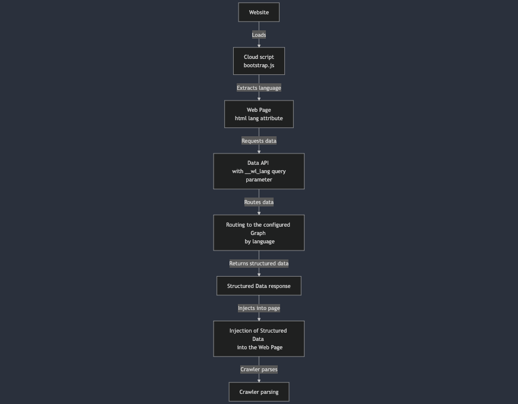

# Multilingual

Each website is linked to a Graph and every Graph is configured with one language and optionally a country.

Multilingual websites can therefore be linked to multiple Graphs each one configured with a specific language.

## Structured Data publishing

Graphs provide the structured data conformant to schema.org, search engine and AI requirements.

Structured data is stored in the form of linked data entities in the Graph. An entity can have a `schema:url` property that it is used to determine which entities (and connected ones) should be publishing for a specific URL.

### Data API

The act of selecting and aggregating this data happens using the Data API which exposes a simple end-point `https://api.wordlift.io/data/https/example.org/page.html`. When calling this end-point, the Data API will return the structured data for the URL `https://example.org/page.html`. The Data API is formatted so that it eases caching by browsers and edge caches in order to boost performance, because it is a simple HTTP GET operation.

In order to know which graph is authoritative for a URL, the Data API queries an internal routing table based on the provided URL, which redirects to the appropriate graph.

When working with multilingual websites, the same path context may refer to a different graph based on the client language, so that another parameter is required to tell the Data API how to select the correct source graph for structured data.

The parameter is called `__wl_lang` and specifies the ISO 639-1 two-letter code for the required language, example `en` for English or `it` for Italian.

For example, the internal routing may have the following configuration, URL example.org is served by:

1. graph https://data.example.org/en, which is also the default, when language is English
1. graph https://data.example.org/it, when language is Italian

So that when requesting https://api.wordlift.io/data/https/example.org/page.html?__wl_lang=en, the Data API will route the request to the https://data.example.org/en graph, whereas requesting https://api.wordlift.io/data/https/example.org/page.html?__wl_lang=it will route the request to the https://data.example.org/it graph.

## Cloud script

The [Cloud](/cloud) script (`bootstrap.js`) will automatically select the correct language by parsing the `html` element's `lang` attribute, for example the `<html lang="en">` tag will tell `bootstrap.js` to request the structured data for the English language, and the script will automatically append the `__wl_lang=en` to the request.

## Flowchart

