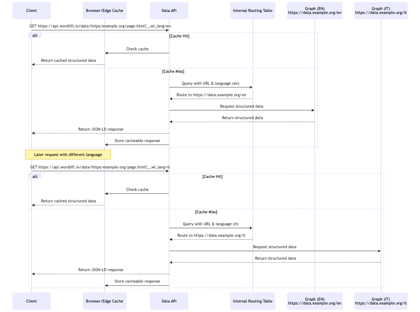

# Multilingual

Each website is linked to a Graph and every Graph is configured with one language and optionally a country.

Multilingual websites can therefore be linked to multiple Graphs each one configured with a specific language.

## Structured Data publishing

Graphs provide the structured data conformant to schema.org, search engine and AI requirements.

Structured data is stored in the form of linked data entities in the Graph. An entity can have a `schema:url` property that it is used to determine which entities (and connected ones) should be publishing for a specific URL.

### Data API

The act of selecting and aggregating this data happens using the [Data API](./data-api.md). When calling the Data API, WordLift returns the structured data for the requested URL as JSON-LD.

When working with multilingual websites, the same path context may refer to a different graph based on the client language. The Data API uses the `__wl_lang` query parameter to select the correct source graph for structured data.

For example, the internal routing may have the following configuration, URL example.org is served by:

1. graph `https://data.example.org/en`, which is also the default, when language is English
1. graph `https://data.example.org/it`, when language is Italian

So that when requesting `https://api.wordlift.io/data/https/example.org/page.html?__wl_lang=en`, the Data API will route the request to the `https://data.example.org/en` graph, whereas requesting `https://api.wordlift.io/data/https/example.org/page.html?__wl_lang=it` will route the request to the `https://data.example.org/it` graph.

See [Data API](./data-api.md) for URL formatting, output format, and client-side or server-side injection options.

## Cloud script

The [Cloud](/cloud) script (`bootstrap.js`) will automatically select the correct language by parsing the `html` element's `lang` attribute, for example the `<html lang="en">` tag will tell `bootstrap.js` to request the structured data for the English language, and the script will automatically append the `__wl_lang=en` to the request.

## WordLift Data API Multilingual Request Flow

