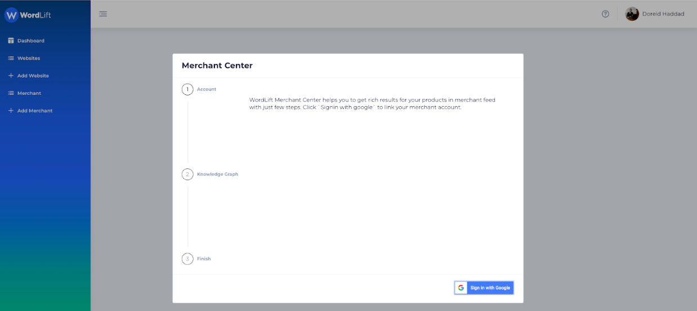
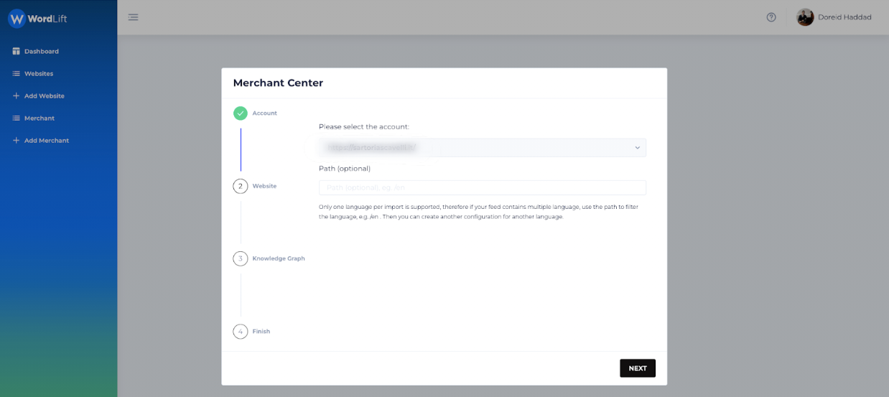

# Product Knowledge Graph Builder

**Product Knowledge Graph Builder** uses your Google Merchant feed to [create a Product Knowledge Graph](https://wordlift.io/blog/en/how-build-product-knowledge-graph/) and publish structured product data on your website.

The generated product data helps search engines understand your catalog and can make products eligible for supported search and shopping experiences.

Product KG Builder imports product data from Merchant Center, maps it to Schema.org, and synchronizes the resulting product graphs with your WordLift Knowledge Graph.

## Compatibility across platforms

Product KG Builder supports non-WordPress e-commerce websites. The generated structured data is added with a script, so the setup is not tied to a specific content management system.

## Get started

When your WordLift subscription includes Product KG Builder, you receive a key that provides access to the WordLift dashboard.

In the dashboard, select **+ Add Merchant** in the left navigation and follow the setup wizard.

### 1. Link your Google account

Sign in with the Google account that can access the Merchant Center account you want to use.

> **Behind the Scenes:**
> Product KG Builder uses OAuth 2.0 to request access to your Merchant Center data without collecting your Google password.

### 2. Choose the Merchant feed

Select the Merchant feed you want to import.

Each import supports one language. If your feed contains multiple languages, use **Path** to filter one language, such as `/en`, and create a separate configuration for each additional language.

> **Behind the Scenes:**
> The tool validates and maps the feed data to create a consistent structure for your Product Knowledge Graph. Language filters help ensure that the correct version of your content is imported.

### 3. Create your Product Knowledge Graph

Link your website to the selected Merchant feed, then add the script provided by the wizard to your website.

Select **Finish** to save the configuration. Product KG Builder can then import the products, create their structured data, and synchronize them with the Knowledge Graph.

Use the WordLift dashboard to start and monitor import synchronization.

> **Behind the Scenes:**
> The script retrieves the structured product data generated from your Merchant feed and makes it available on the corresponding product pages.

### Configuration and enrichment capabilities

Product KG Builder provides the following configuration and enrichment options:

- Preserve the Google product category as a structured `CategoryCode` and apply dated sale prices during their validity window. See [Feed Specifications](./feed-specifications.md) for mappings and examples.
- Reassign an existing Merchant feed configuration to another Google account.
- Configure a custom domain and select the dataset to use. See [Custom Domain Configuration](/enterprise/custom-domain-configuration/) for setup details.
- Monitor import synchronization from the dashboard.
- Customize the seller name independently of the Merchant feed.

## Advanced integration

Use the [webhooks integration](./webhooks.md) to transform RDF generated from Merchant Center product data before Product KG Builder writes it to the Graph store.

## Configure canonical product URLs

Set the Google Merchant Center `canonical_link` attribute to the stable product URL that Google should associate with the product. Keep this value consistent with the canonical URL declared on the product page. See Google's [Google Search index link documentation](https://support.google.com/merchants/answer/9340054?hl=en) for requirements and examples.

## Microsoft Marketplace integration

Product Knowledge Graph Builder is also available through Microsoft Marketplace for customers who want to manage the subscription through their Microsoft account.

To get started:

1. Open the [WordLift Product Knowledge Graph Builder listing](https://marketplace.microsoft.com/en-us/product/web-apps/wordlift1610701057853.seo-merchant-feed?tab=Overview).
2. Review the available plans and select **Get it now** to activate the service.
3. Follow the standard setup process described above.
