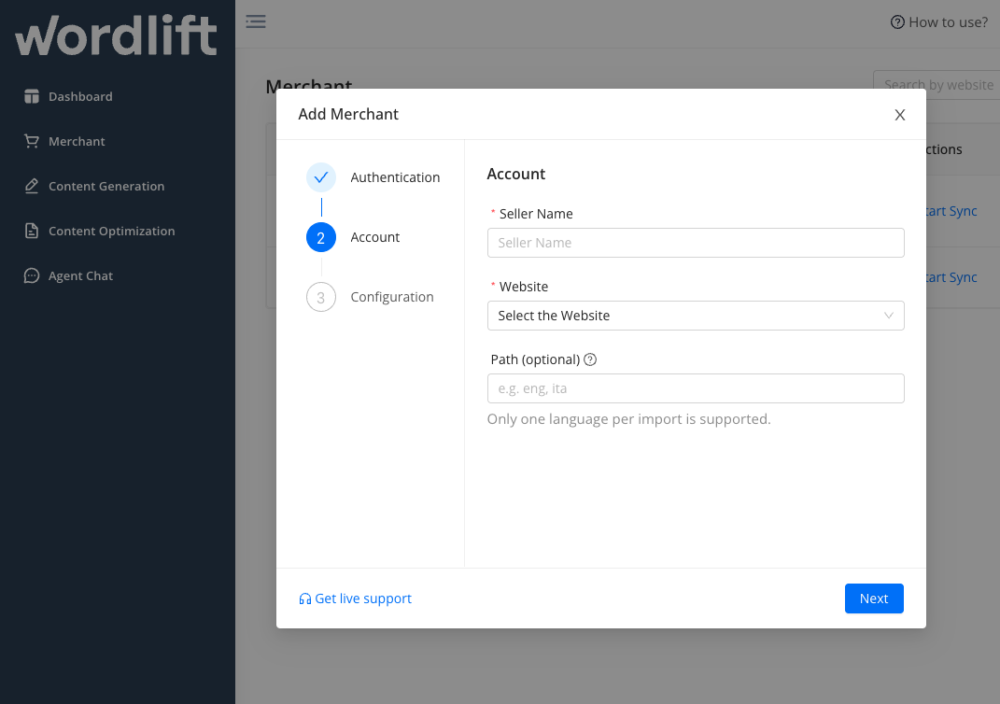

# Product Knowledge Graph Builder
**Product KG Builder** is the feature for e-commerce that allows you to automate your SEO and **[create a Product Knowledge Graph](https://wordlift.io/blog/en/how-build-product-knowledge-graph/) with your Google Merchant Feed.**

This helps e-commerce to **communicate with Google’s Shopping Graph and get free listings in Google Shopping**. At the same time, it **improves the user experience** by providing your customers with information that is relevant to their search.

WordLift [Product Knowledge Graph Builder](https://wordlift.io/seo-for-non-wordpress-ecommerce/) can make a difference in your e-commerce and positively **impact both organic traffic and sales.**

## Compatibility Across Platforms
Our Product Knowledge Graph Builder is designed **for e-commerce platforms no WordPress**. It's the perfect solution **for any CMS, including Shopify, Magento, Joomla, and Drupal**. This means no matter what technology powers your e-commerce site, you can easily integrate our tool to enhance your SEO and visibility on Google Shopping. It's simple, straightforward, and ensures no one is left out.

## Get Started
Once you have purchased the WordLift [Business subscription](https://wordlift.io/pricing/) you will receive a key and then you will be able to access your dashboard.

The first step to start using your PKG Builder is to go to your dashboard and click on **+ Add Merchant** on the left side, then follow the simple steps in the wizard.

### 1. Link your Google Account
Sign in with your Google account.

### 2. Choose the Merchant Feed
Select the Merchant Feed you want to import.

At the moment, only one language per import is supported, therefore if your feed contains multiple languages, use the Path to filter the language, e.g. **/en** . Then you can create another configuration for another language.

### 3. Create your Product Knowledge Graph
Link the website and import the data from the Merchant Feed to the website. To **create your Product Knowledge Graph** you need to add the script into your website.

Click **Finish**. Once you have completed these 3 steps, you will see that the **products** have been imported into the backend of your e-commerce website and **already enriched with structured data.**

From the WordLift dashboard, you can open the backend of your website and see the products imported and you can synchronize the data (it takes about 1 hour).

### Last Update 

The update of [Product Knowledge Graph Builder](https://wordlift.io/seo-for-non-wordpress-ecommerce/) added important elements to this feature:
- You can **reassign an existing merchant feed configuration to another Google account** that is not the same as the originally configured account. This way you have control over your data even if the platform was configured by someone else;
- In the PKG Builder configuration, you can **add a custom domain** and specify the dataset you want to use;
- You can check the **inport synchronization** at any time;
- **Change the "Seller Name."** This element, which cannot be edited in the Merchant Feed, is customizable in our Builder.

## IMPORTANT 
To ensure the proper implementation of structured data and Knowledge Graph, **it is crucial to effectively manage canonical links for products within the Google Merchant Center**. To gain a comprehensive understanding of how to accomplish this task, we highly recommend referring to Google's official documentation available at the [following link.](https://support.google.com/merchants/answer/9340054?hl=en)
