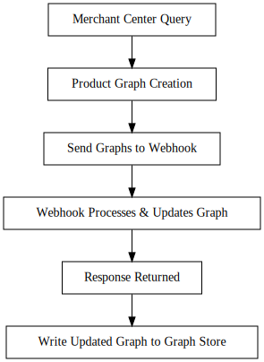

# Webhooks

> **What is a webhook?** A webhook is a method used to send real-time data updates from one application to another as soon as an event occurs. It allows for seamless integration and communication between systems by automatically triggering a callback when specific events take place.


## Introduction

This guide explains the new webhooks feature in the Product Knowledge Graph Builder. With webhooks, your platform can modify RDF data from the Merchant Center before it’s committed to the Graph store. This enables greater customization of product graphs, enhancing SEO and ensuring that your product information is as accurate and enriched as possible.

---

## How It Works

The integration process works in the following sequence:

1. **Retrieve Product from Google Merchant Center:**
   The Platform KG Builder queries the Merchant Center to retrieve product data.

2. **Product Graph Creation:**
   A product graph is generated for each product based on the imported Merchant Feed data.

3. **Webhook Invocation:**
   The Platform KG Builder sends product graphs in batches to your webhook endpoint via an HTTP POST request. The webhook is expected to process (e.g., enhance, validate, or modify) the RDF data.

4. **Response Processing:**
   Your webhook replies with the updated RDF graph. The Platform KG Builder then writes this updated data to the Graph store.

---

## Integration Diagram

Below is a flow diagram that visualizes the webhook integration process:




*Figure: Flow Diagram of the Webhook Integration Process*

---

## Technical Details

### Endpoint Details

- **HTTP Method:** POST
- **Endpoint Example:**
  `https://example.org/webhook/calls`

### Request Headers

- `Content-Type: application/json; charset=utf-8`

### Request Payload Structure

The payload is a JSON object that includes:
- **webhook_name:** Identifier for the event (e.g., `"productkg_preupdate"`).
- **items:** An array of product objects where each product has:
  - **id:** Unique identifier (typically a URL).
  - **rdf:** An object containing:
    - **format:** RDF format (e.g., `"turtle"`).
    - **data:** The actual RDF data in a string format.

### Example Request (Step-by-Step)

1. **Prepare the CURL Command:**

   ```bash
   curl -X "POST" "http://localhost:8080/webhook/calls" \
        -H 'Content-Type: application/json; charset=utf-8' \
        -d '{
     "webhook_name": "before_productkg_create",
     "items": [
       {
         "id": "https://data.example.org/test-841554094878123/01/7895653316409",
         "rdf": {
           "format": "turtle",
           "data": "<https://data.example.org/test-841554094878123/01/7895653316409/size-0>..."
         }
       }
     ]
   }'
   ```

2. **Send the Request:**
   Run the above CURL command in your terminal. This POST request sends the product graphs to your webhook endpoint for processing.

### Example Response

Your webhook should respond with an HTTP 200 status and a JSON payload that contains the updated RDF data. For example:

```http
HTTP/1.1 200 OK
Content-Type: application/json
Content-Length: 8998
connection: close

{
  "items": [
    {
      "id": "https://data.example.org/test-841554094878123/01/7895653316409",
      "rdf": {
        "format": "turtle",
        "data": "<https://data.example.org/test-841554094878123/01/7895653316409/size-0>..."
      }
    }
  ]
}
```

*Note:* The response must include the updated RDF data exactly as processed by your webhook.

---

## Step-by-Step Example Walkthrough

1. **Graph Creation:**
   The Platform KG Builder retrieves product data and creates RDF graphs for each product.

2. **Webhook Call:**
   Each graph is sent via an HTTP POST request to your webhook endpoint. Use the CURL command provided above to simulate a call.

3. **Webhook Processing:**
   Your webhook receives the JSON payload, processes the RDF data (for example, altering specific fields or adding new metadata), and returns the updated graph.

4. **Data Synchronization:**
   Upon receiving the HTTP 200 response with the updated RDF graphs, the Platform KG Builder writes the data to the Graph store.

---

## Conclusion

By following this guide, integrators can easily set up and test the webhook functionality. This feature not only enables real-time manipulation of product graphs but also ensures that your e-commerce platform communicates effectively with Google’s Shopping Graph, boosting both search visibility and customer engagement.

For further questions or support, please refer to our support documentation or contact the development team.
