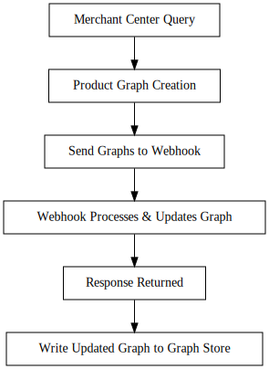

# Webhooks

Product Knowledge Graph Builder webhooks let an integrator transform generated RDF during product synchronization, before the data is written to the Graph store. The callback is a synchronous batch transformation within the synchronization process, not a real-time event notification.

## Processing flow

1. Product KG Builder retrieves product data from Google Merchant Center.
2. It generates an RDF graph for each product.
3. It sends the graphs to the configured webhook endpoint in batches of up to 100 items.
4. The endpoint returns the transformed RDF for the products that should continue through synchronization.
5. Product KG Builder uses each returned `id` to look up the original product association and writes the returned graph to the Graph store.



## HTTP contract

Configure a publicly reachable HTTPS endpoint to protect product data in transit. Product KG Builder sends a `POST` request to the configured HTTP or HTTPS URL with the following headers:

```http
Accept: application/json
Content-Type: application/json
```

The request object contains:

- `webhook_name`: the event identifier. Product KG Builder uses `productkg_preupdate`.
- `items`: an array containing up to 100 product graph objects.
  - `id`: the product graph identifier, typically a URL.
  - `rdf`: the RDF payload.
    - `format`: the RDF serialization. Requests use `turtle`.
    - `data`: the serialized RDF string.

### Example request

```bash
curl --request POST 'https://example.org/webhook/calls' \
  --header 'Content-Type: application/json' \
  --data '{
    "webhook_name": "productkg_preupdate",
    "items": [
      {
        "id": "https://data.example.org/products/7895653316409",
        "rdf": {
          "format": "turtle",
          "data": "<https://data.example.org/products/7895653316409> a <https://schema.org/Product> ."
        }
      }
    ]
  }'
```

## Response requirements

Return a successful `2xx` response with an `application/json` body containing an `items` array. Return each request item with its original `id` so Product KG Builder can preserve its association with the source product.

Return every request item, even when its RDF is unchanged. Do not use omitted items as a product-filtering mechanism; empty-response fallback behavior can restore the original input.

Response RDF can use `turtle`, `jsonld`, or `n-triples`. The `data` value must be valid for the declared format.

```http
HTTP/1.1 200 OK
Content-Type: application/json

{
  "items": [
    {
      "id": "https://data.example.org/products/7895653316409",
      "rdf": {
        "format": "turtle",
        "data": "<https://data.example.org/products/7895653316409> a <https://schema.org/Product> ."
      }
    }
  ]
}
```

A non-`2xx` response, malformed JSON, invalid RDF, or an unsupported response shape prevents Product KG Builder from accepting that callback result and can interrupt the synchronization. Authentication, retry, and timeout behavior are not defined by this payload contract; confirm operational requirements with WordLift before deployment.
