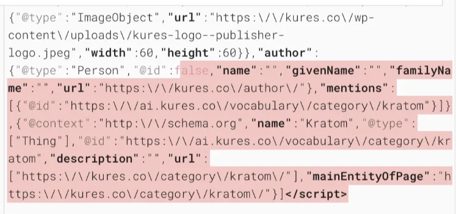
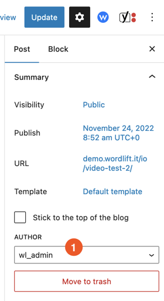
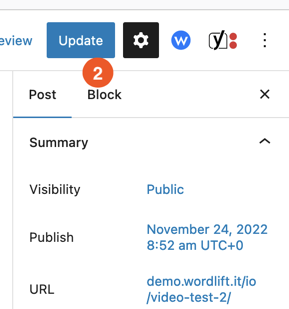

# Troubleshooting

## Author's @id is null

This is due to WordPress not updating the post's author property when an author is removed.

To fix follow this steps:

1. Open the Edit Post screen and look for the `author` property in the sidebar

2. Select a valid author and update

Now check the structured data again, the problem should be solved.