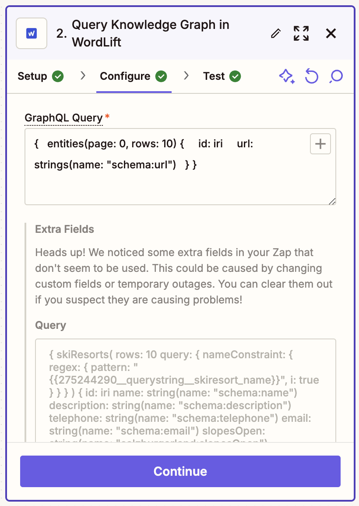

# WordLift Zapier Integration

The [WordLift Zapier Integration](https://zapier.com/apps/wordlift/integrations) allows you to **automate your semantic SEO workflows** by connecting WordLift with over 6,000+ apps. You can now leverage the power of Agent WordLift and your Knowledge Graph data across your entire marketing stack.

## Get Started

### 1. Authentication

To get started with the WordLift Zapier integration, you'll need your WordLift API Key. This is the same key you use to access your Knowledge Graph.

1. Search for "WordLift" in the Zapier integrations directory
2. Click on "Add Connection"
3. Enter your WordLift API Key
4. Click "Continue" to validate your credentials

### 2. Available Actions

The WordLift Zapier integration provides two powerful actions:

#### Ask Agent WordLift

Send commands or questions to Agent WordLift and receive intelligent responses. Use this to:

- Extract entities from text
- Analyze content for SEO optimization
- Generate content recommendations
- Reuse content from your website
- Analyze Schema.org markup on a webpage

#### Query Knowledge Graph

Run GraphQL queries to retrieve specific data from your WordLift Knowledge Graph. This allows you to:

- Extract structured data
- Monitor entity relationships
- Track content performance
- Generate custom reports

### 3. Popular Use Cases

With WordLift's Zapier integration, marketers can:

- Automatically analyze new blog posts when published
- Send content data to reporting tools
- Trigger content optimization workflows
- Sync entity data with CRM systems
- Create automated content briefs
- Monitor SEO performance metrics

## Create Your First Zap

Get started with our pre-built workflows or create your own custom automation:

</zapier-workflow>
    `
  }}
/>

:::info Note
Watch our tutorial video to learn how to create powerful automation workflows with WordLift and Zapier.
:::

## Examples

Here are some popular workflow templates to get you started:

1. **Content Optimization Pipeline**
   - Trigger: New WordPress post
   - Action: Ask Agent WordLift to analyze content
   - Action: Send optimization recommendations to Slack

2. **Automated SEO Reporting**
   - Trigger: Daily schedule
   - Action: Query Knowledge Graph for performance metrics
   - Action: Update Google Sheets dashboard

3. **Content Distribution Workflow**
   - Trigger: New entity created
   - Action: Query Knowledge Graph for entity data
   - Action: Create social media posts via Buffer

## Need Help?

If you need assistance setting up your WordLift Zapier integration or have questions about specific workflows, please contact our support team at [support@wordlift.io](mailto:support@wordlift.io).
